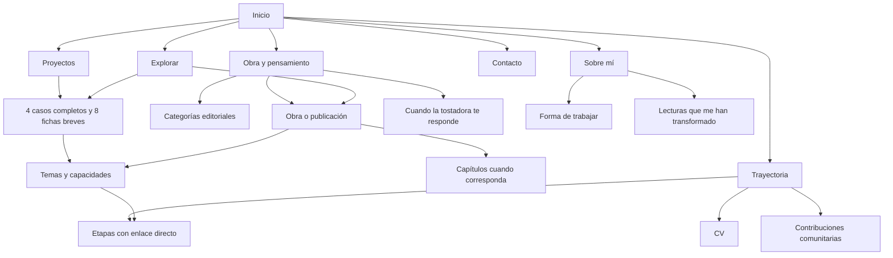

# Mapa de navegación de Paynalton

Actualizado el 28 de septiembre de 2026 conforme a *Contenidos editoriales de Paynalton*, versión 1.0. Este mapa resume la navegación acordada y las incorporaciones editoriales. Las direcciones nuevas son propuestas bajo el dominio de producción; su presencia aquí no implica publicación.

## Navegación principal

**Proyectos · Trayectoria · Obra y pensamiento · Sobre mí · Contacto**

La marca Paynalton enlaza a https://paynalton.tech/es/. Buscar lleva a https://paynalton.tech/es/explorar/. CV e índice de temas son accesos secundarios permanentes. La raíz https://paynalton.tech/ conduce a Inicio.

## Mapa general

Las categorías y los términos ofrecen recorridos complementarios. Una pieza conserva una sola dirección principal aunque aparezca en varias selecciones.

## Páginas y funciones

| URL propuesta | Función | Contenido en orden de lectura |
| --- | --- | --- |
| https://paynalton.tech/es/ | Inicio | Presentación, proyectos destacados, selección de obras, síntesis personal, CV y contacto |
| https://paynalton.tech/es/proyectos/ | Catálogo profesional | Introducción, filtros, doce proyectos con estado visible y acceso a casos o fichas |
| https://paynalton.tech/es/trayectoria/ | Experiencia profesional | Resumen, CV, once etapas, capacidades, formación autodidacta y contribuciones comunitarias |
| https://paynalton.tech/es/obra/ | Obra y pensamiento | Introducción, selección editorial, categorías y catálogo |
| https://paynalton.tech/es/sobre-mi/ | Perfil personal | Historia, intereses, valores, lecturas personales y forma de trabajar |
| https://paynalton.tech/es/contacto/ | Contacto | Motivos para conversar, correo principal, canales públicos y CV |
| https://paynalton.tech/es/explorar/ | Búsqueda global | Consulta, filtros por tipo y tema, resultados y acceso a catálogos |
| https://paynalton.tech/es/temas/ | Índice transversal | Términos agrupados por tema, tecnología, capacidad, sector y género |
| https://paynalton.tech/es/cv/ | CV consultable e imprimible | Perfil, experiencia seleccionada, capacidades, formación documentada, contacto y descarga |

La raíz `https://paynalton.tech/` conducirá a `https://paynalton.tech/es/`. No habrá dos copias independientes de Inicio.

## Recorrido profesional

Inicio destaca **Pipila, Onix y GUACAMAYA**, en ese orden. El catálogo reúne cuatro casos completos y ocho fichas breves; una ficha puede crecer sin cambiar su dirección.

| Bloque editorial | Proyecto | URL propuesta | Presentación y estado |
| --- | --- | --- | --- |
| PRO-05 | Pipila | https://paynalton.tech/es/proyectos/pipila/ | Caso completo; en operación y evolución; destacado |
| PRO-01 | Onix | https://paynalton.tech/es/proyectos/onix/ | Caso completo; sistema vigente y modernización en pruebas; destacado |
| PRO-08 | GUACAMAYA | https://paynalton.tech/es/proyectos/guacamaya/ | Caso completo; en desarrollo y uso personal; destacado |
| PRO-02 | Winner | https://paynalton.tech/es/proyectos/winner/ | Caso histórico completo; operación actual por confirmar |
| PRO-09 | Yayauhqui | https://paynalton.tech/es/proyectos/yayauhqui/ | Ficha breve; aplicación descrita, ciclo de mantenimiento por precisar |
| PRO-10 | SpellChecker | https://paynalton.tech/es/proyectos/spellchecker/ | Ficha breve; aplicación descrita, ciclo de mantenimiento por precisar |
| PRO-11 | LORO | https://paynalton.tech/es/proyectos/loro/ | Ficha breve; en desarrollo con aplicación real |
| PRO-12 | PERICO | https://paynalton.tech/es/proyectos/perico/ | Ficha breve; en desarrollo, sin oferta comercial disponible confirmada |
| PRO-03 | Delta | https://paynalton.tech/es/proyectos/delta/ | Ficha breve; primera versión propia y mantenimiento delegado; en desuso |
| PRO-04 | Delta Commerce | https://paynalton.tech/es/proyectos/delta-commerce/ | Ficha breve; arquitectura y consultoría; utilizada en una tienda |
| PRO-06 | K4Y | https://paynalton.tech/es/proyectos/k4y/ | Ficha breve; desarrollo de todas las funcionalidades; lanzamiento no confirmado |
| PRO-07 | Holstein | https://paynalton.tech/es/proyectos/holstein/ | Ficha breve; diseño completo y desarrollo aproximado del 70 %; producción desconocida |

Las fichas breves contienen descriptor, explicación disponible, participación y estado conocidos, temas y relaciones respaldadas. No se amplían artificialmente para completar un caso. Los datos por validar son tareas editoriales, no afirmaciones listas para publicar. Estas direcciones se conservan si después crece el contenido.

Trayectoria contiene once etapas, de Freeway a Computadoras DAE, con enlaces directos dentro de https://paynalton.tech/es/trayectoria/. Freeway comienza en junio de 2025; SoDigital mantiene el período 2020–2025. Los proyectos enlazan a las etapas que corresponden cuando esa relación esté respaldada y sea publicable.

Las capacidades se reúnen en https://paynalton.tech/es/trayectoria/#capacidades y la formación autodidacta en https://paynalton.tech/es/trayectoria/#formacion. Las contribuciones a VegaStrike, el conector DBASE/DBF, GNOME-Look y Linux Mint se presentan en https://paynalton.tech/es/trayectoria/#comunidad, conservando su estado real. No se presenta una aportación pendiente como aceptada.

El CV se consulta en https://paynalton.tech/es/cv/ y su descarga propuesta es https://paynalton.tech/descargas/paynalton-cv.pdf. El CV se actualizará y generará después de terminar el sitio, usando los hechos definitivos de perfil y trayectoria. Durante el desarrollo se reserva este destino; no se ofrece una descarga inexistente.

## Recorrido de obra y pensamiento

| Obra identificada | URL propuesta o conservada | Forma de publicación |
| --- | --- | --- |
| Cuando la tostadora te responde | https://paynalton.tech/es/books/cuando-la-tostadora-te-responde/ | Conservar; ficha del libro, sinopsis, índice y descargas |
| Aritmética con números indeterminados | https://paynalton.tech/es/obra/aritmetica-con-numeros-indeterminados/ | Ficha y cuerpo o acceso a lectura, según revisión de la obra |
| ¿Qué es la inteligencia? | https://paynalton.tech/es/obra/que-es-la-inteligencia/ | Presentación de la serie e índice de entregas |
| La imposibilidad de construir una esfera de Dyson | https://paynalton.tech/es/obra/la-imposibilidad-de-construir-una-esfera-de-dyson/ | Ensayo con referencias y contexto |
| Dimensiones conectadas | https://paynalton.tech/es/obra/dimensiones-conectadas/ | Ficha y lectura, con alcance de la propuesta teórica |
| Las cámaras roban tu alma | https://paynalton.tech/es/obra/las-camaras-roban-tu-alma/ | Ensayo y contexto de publicación |

“Paynalton”, “Relatos de sangre y muerte” y “Mis otros relatos” se tratan inicialmente como fuentes o colecciones por conciliar. No se crean tres obras ficticias a partir de enlaces a blogs. Las piezas seleccionadas de esos sitios recibirán sus propias entradas; el duplicado de “Relatos de sangre y muerte” se fusionará.

Las adaptaciones de autores ajenos y *El Águila Vuela* quedan fuera del catálogo y no reciben rutas nuevas. Esta exclusión no implica eliminar sus originales. OBR-02 y los candidatos OBR-04, OBR-07, OBR-08 y OBR-09 conservan las direcciones propuestas, pero requieren lectura y revisión antes de publicarse. Los textos no cotejados no se incorporan al catálogo como fichas terminadas.

### Obras aplazadas por decisión del autor

*Alma*, de *Crónicas de Yoliraeth*, y el proyecto *Blanco, Negro y Gris* son obras sin terminar y **no se publicarán por el momento**. OBR-11 y OBR-12 quedan fuera del catálogo, destacados, fichas, capítulos, búsqueda, índices públicos y exportaciones. No se asignan URLs públicas ni se muestran enlaces o anuncios de próxima publicación para estas obras.

Sus materiales se conservan para trabajo editorial futuro. Su incorporación requerirá una nueva decisión del autor. Las menciones de estos proyectos dentro de otros textos, como el caso de GUACAMAYA, se revisarán como contexto biográfico o de proceso, sin convertirlas en acceso a las obras ni prometer su publicación.

Las obras se encuentran desde el catálogo, las categorías y los temas. Literatura, Filosofía y Ensayos y divulgación conservan sus direcciones propuestas:

- https://paynalton.tech/es/obra/categorias/literatura/
- https://paynalton.tech/es/obra/categorias/filosofia/
- https://paynalton.tech/es/obra/categorias/ensayos-y-divulgacion/

La categoría no cambia la dirección de una obra. Las selecciones vacías no aparecen en la navegación. El libro publicado se distingue de los ensayos pendientes de cotejo. Las obras aplazadas no aparecen en el catálogo.

Los capítulos revisados de obras nuevas utilizan https://paynalton.tech/es/obra/{obra}/capitulos/{capitulo}/. Los del libro existente conservan la base https://paynalton.tech/es/books/cuando-la-tostadora-te-responde/capitulos/{capitulo}/. Las llaves indican nombres pendientes, no direcciones disponibles. Cada capítulo ofrece acceso al índice y continuidad de lectura; las entregas autónomas conservan una sola URL.

## Recorrido personal y contacto

Sobre mí reúne historia, intereses, valores y método de trabajo. Las secciones nuevas son:

| Destino | Contenido editorial |
| --- | --- |
| https://paynalton.tech/es/sobre-mi/#forma-de-trabajar | MET-INTRO y MET-01 a MET-06 |
| https://paynalton.tech/es/sobre-mi/#lecturas | BIO-03 y LEC-01 a LEC-04 |
| https://paynalton.tech/es/sobre-mi/#musica | BIO-04 y enlace confirmado |

Las lecturas de La rebelión de Atlas, Así hablaba Zaratustra, El último encuentro y El juego de Ender son interpretaciones personales de Paynalton. Permanecen en Sobre mí y no se presentan como libros de su autoría dentro del catálogo de obras.

Contacto utiliza CON-01 a CON-03. Ofrece correo, LinkedIn, GitHub, Reddit, TikTok, Telegram y Goodreads; Discord y apoyo quedan en un bloque secundario con destinos comprobados. No se crea recepción de formularios ni procesamiento de pagos dentro del sitio.

## Navegación por temas y relaciones

TAX-01 define los nueve términos iniciales:

| Término | URL propuesta |
| --- | --- |
| Resolución de problemas | https://paynalton.tech/es/temas/resolucion-de-problemas/ |
| Arquitectura de soluciones | https://paynalton.tech/es/temas/arquitectura-de-soluciones/ |
| Integración de sistemas | https://paynalton.tech/es/temas/integracion-de-sistemas/ |
| Modernización | https://paynalton.tech/es/temas/modernizacion/ |
| Liderazgo técnico | https://paynalton.tech/es/temas/liderazgo-tecnico/ |
| IA aplicada | https://paynalton.tech/es/temas/ia-aplicada/ |
| Memoria y contexto de agentes | https://paynalton.tech/es/temas/memoria-y-contexto-de-agentes/ |
| Creación editorial | https://paynalton.tech/es/temas/creacion-editorial/ |
| Inteligencia y humanidad | https://paynalton.tech/es/temas/inteligencia-y-humanidad/ |

Los términos técnicos adicionales se incorporan cuando tengan definición y contenido asociado. Las páginas de términos separan proyectos, etapas, obras y lecturas personales.

| Origen | Relación y destino de TAX-02 |
| --- | --- |
| Pipila | Demuestra integración de sistemas |
| Onix | Demuestra modernización; utiliza LORO en su metodología |
| GUACAMAYA | Apoya la creación de Cuando la tostadora te responde |
| PERICO | Implementa LORO |
| SpellChecker | Aplica IA en su funcionamiento |
| Yayauhqui | Se desarrolló con asistencia de IA; su análisis utiliza heurísticas |
| Lectura personal de El juego de Ender | Inspira reflexión en inteligencia y humanidad |

El enlace desde GUACAMAYA llega a la dirección conservada del libro; los enlaces a herramientas llegan a sus fichas públicas, no a repositorios privados. Los motivos visibles se toman de TAX-02, conservando la dirección de cada relación.

No se deducen relaciones laborales por coincidencia de fechas o tecnologías. Una relación debe tener fundamento y ser útil para el lector.

## Búsqueda y orientación

Explorar reúne proyectos, obras, etapas, términos, lecturas personales y contribuciones comunitarias. Los resultados de secciones sin página propia enlazan a su ancla. Los filtros se conservan al volver desde un resultado, y los catálogos ofrecen enlaces utilizables sin búsqueda interactiva.

Las páginas interiores muestran su colección de origen, enlaces relacionados y un retorno claro. La página del libro puede pertenecer a Obra y pensamiento sin cambiar su dirección histórica. La navegación principal debe ser utilizable con teclado y conservar los mismos destinos en móvil.

## Transición de direcciones

| Origen público | Destino propuesto | Tratamiento |
| --- | --- | --- |
| https://paynalton.tech/ | https://paynalton.tech/es/ | Entrada estable a Inicio |
| https://paynalton.tech/es/ | https://paynalton.tech/es/ | Conservar y reorganizar |
| https://paynalton.tech/es/projects/ | https://paynalton.tech/es/proyectos/ | Redirección permanente cuando el catálogo esté publicado |
| https://paynalton.tech/es/jobs/ | https://paynalton.tech/es/sobre-mi/#forma-de-trabajar | Redirección al contenido equivalente |
| https://paynalton.tech/es/about/ | https://paynalton.tech/es/sobre-mi/ | Redirección permanente |
| https://paynalton.tech/es/ideas/ | https://paynalton.tech/es/obra/ | Redirección permanente |
| https://paynalton.tech/es/contact/ | https://paynalton.tech/es/contacto/ | Redirección permanente |
| https://paynalton.tech/es/books/cuando-la-tostadora-te-responde/ | Misma URL | Conservar como página canónica del libro |
| https://paynalton.tech/books/cuando-la-tostadora-te-responde/cuando-la-tostadora-te-responde-es.pdf | Misma URL | Conservar descarga |
| https://paynalton.tech/books/cuando-la-tostadora-te-responde/cuando-la-tostadora-te-responde-es.epub | Misma URL | Conservar descarga |
| https://paynalton.tech/rss.xml | Misma URL | Mantener dirección y alimentar con las publicaciones seleccionadas |
| https://paynalton.tech/sitemap-index.xml | Misma URL | Reflejar únicamente las páginas canónicas publicadas |

Los enlaces antiguos dentro de Inicio necesitan un tratamiento específico porque sus fragmentos no constituyen páginas independientes:

| Enlace existente | Compatibilidad propuesta |
| --- | --- |
| https://paynalton.tech/es/#profile | Conservar el punto de entrada en la presentación |
| https://paynalton.tech/es/#experience | Conservar un resumen con enlace a Trayectoria |
| https://paynalton.tech/es/#skills | Conservar una síntesis de capacidades y sus enlaces |
| https://paynalton.tech/es/#softskills | Conservar una síntesis con enlace a Forma de trabajar |

Las redirecciones se aplican solo cuando el destino equivalente esté listo. Deben ir directamente al destino final, sin cadenas ni bucles. Los enlaces del propio sitio apuntarán a las nuevas direcciones. Si el alojamiento no permite redirecciones permanentes, se prepararán páginas estáticas de transición con enlace explícito; no se presentará esa alternativa como equivalente a una respuesta HTTP de redirección.

No se crea una segunda ficha de *Cuando la tostadora te responde* bajo el catálogo general. Las migas de navegación pueden situarla dentro de Obra y pensamiento aunque conserve su dirección histórica.

## Correspondencia editorial y publicación

- Inicio: PER-01 e INI-01 a INI-10, con los tres destacados definidos.
- Proyectos: PRO-INTRO y PRO-01 a PRO-12, respetando la diferencia entre caso completo y ficha breve.
- Trayectoria y CV: PER-02, TRA-INTRO, TRA-01 a TRA-11, TRA-ANT, PER-03, CAP y COM.
- Obra: OBR-INTRO, presentaciones de secciones y fichas OBR revisadas; OBR-11 y OBR-12 quedan fuera de la publicación actual.
- Sobre mí: BIO, MET y LEC; las reseñas no se mezclan con las obras propias.
- Contacto: CON. Temas: TAX. Rótulos y estados: NAV-01 y únicamente los textos UI-01 que correspondan a funciones implementadas.

Los títulos y descripciones de la sección editorial 12.6 pueden utilizarse en las páginas indicadas, después de revisión. Esta excepción no autoriza publicar el resto del anexo. Las notas «no publicar», instrucciones y datos reservados quedan fuera de páginas, búsqueda y exportaciones. Las fuentes de trabajo no se convierten automáticamente en enlaces de navegación.

El estado editorial de una ficha se controla por separado del estado de la obra o del software. Se puede publicar una presentación revisada de un proyecto en desarrollo; no se puede presentar su función futura como entregada. Las revisiones pendientes no son imposibilidades técnicas.

La actualización de estos mapas no aplica redirecciones ni altera el sitio publicado.

## Criterio actualizado de suficiencia editorial

Las aclaraciones del propietario resuelven la recopilación necesaria de Delta, Delta Commerce, K4Y y Holstein. Se describe su aportación sin investigar lanzamientos desconocidos ni exigir métricas, clientes o fuentes públicas para cada ficha. Winner se mantiene como caso histórico sin investigar su operación actual como requisito. Continúa la revisión de información publicable que afecte al contenido elegido.

Las direcciones de obras pendientes son propuestas disponibles para una selección futura, no una obligación de recuperar todo el catálogo antes de avanzar. La incorporación de obras completas y revisión de original, autoría y versión se realiza al finalizar el proyecto. Durante el desarrollo se utilizan ejemplos configurables. Las obras expresamente aplazadas permanecen excluidas. Se conservan el lector y los controles técnicos del sitio.

## Secuencia vigente: ejemplos configurables, obras completas y CV

Durante el desarrollo, la biblioteca utiliza ejemplos claramente identificados. Debe permitir agregar, retirar, ordenar y seleccionar obras, categorías y destacados sin modificar las páginas que los presentan. La misma selección alimenta catálogo, Inicio, relaciones y búsqueda. El estado de publicación se controla por pieza y los ejemplos se distinguen del contenido definitivo.

Los ejemplos cubren las variantes de lectura necesarias: pieza breve y obra con capítulos, además de ficha, índice y navegación. Se usa contenido de prueba propio o fragmentos autorizados, sin atribuir al autor textos inventados ni presentar una muestra como obra íntegra. No se utilizan Alma, Blanco, Negro o Gris como ejemplos para eludir su exclusión.

Al finalizar el proyecto se incorporarán las obras completas seleccionadas y revisadas, sustituyendo o retirando los ejemplos. La selección es configurable; las propuestas de títulos de este mapa no fijan un catálogo obligatorio. Los ejemplos no pasan a la publicación definitiva por defecto. Esta organización no requiere un panel de administración ni servicios externos.

El CV se actualizará y generará después de terminar el sitio. Su ruta y espacios de acceso quedan previstos; la descarga se habilita cuando exista el documento final. El desarrollo de las páginas, la búsqueda y el lector no depende de disponer del CV ni de las obras completas.
