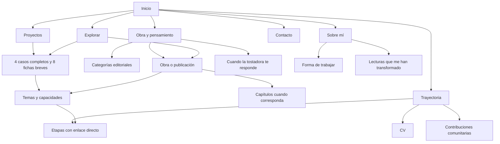

# Propuesta de mapa de rutas y estructura de contenidos

Esta propuesta permite preparar la navegación y la organización del sitio mientras se revisan los textos. Describe destinos públicos y contenido esperado; no implica que las nuevas páginas estén publicadas. Las URLs nuevas son propuestas bajo el dominio de producción `https://paynalton.tech`.

Actualizado el 28 de septiembre de 2026 a partir de *Contenidos editoriales de Paynalton*, versión 1.0. Sus correcciones sustituyen las hipótesis del inventario anterior. Los identificadores editoriales incluidos aquí permiten asignar los textos a sus destinos; no se mostrarán como contenido público.

## 1. Decisiones propuestas

- Conservar `https://paynalton.tech/es/` como Inicio y base de las secciones.
- Mantener el menú **Proyectos · Trayectoria · Obra y pensamiento · Sobre mí · Contacto**. La marca Paynalton lleva a Inicio.
- Ofrecer **Explorar** como acceso permanente a búsqueda y filtros. CV e índice de temas serán accesos secundarios.
- Crear una página por proyecto y una entrada por obra. Las categorías no forman parte de la dirección de una obra, para permitir reclasificarla sin cambiar su URL.
- Presentar las once etapas laborales en una cronología con enlaces directos a cada etapa. No crear once páginas que repitan la misma información.
- Conservar la dirección pública de *Cuando la tostadora te responde* y sus descargas. La biblioteca enlazará a esa página como entrada canónica del libro.
- Integrar los hábitos de trabajo en Sobre mí. La dirección actual de esa sección debe llevar a su contenido equivalente.
- Publicar páginas estáticas y resolver búsqueda y filtros en el navegador, sin servicios de pago ni procesamiento remoto de operaciones del sitio.

## 2. Mapa general

Las categorías y los términos ofrecen recorridos complementarios. Una pieza conserva una sola dirección principal aunque aparezca en varias selecciones.

## 3. Rutas principales

| URL propuesta | Función | Contenido en orden de lectura |
| --- | --- | --- |
| https://paynalton.tech/es/ | Inicio | Presentación, proyectos destacados, selección de obras, síntesis personal, CV y contacto |
| https://paynalton.tech/es/proyectos/ | Catálogo profesional | Introducción, filtros, doce proyectos con estado visible y acceso a casos o fichas |
| https://paynalton.tech/es/trayectoria/ | Experiencia profesional | Resumen, CV, once etapas, capacidades, formación autodidacta y contribuciones comunitarias |
| https://paynalton.tech/es/obra/ | Obra y pensamiento | Introducción, selección editorial, categorías y catálogo |
| https://paynalton.tech/es/sobre-mi/ | Perfil personal | Historia, intereses, valores, lecturas personales y forma de trabajar |
| https://paynalton.tech/es/contacto/ | Contacto | Motivos para conversar, correo principal, canales públicos y CV |
| https://paynalton.tech/es/explorar/ | Búsqueda global | Consulta, filtros por tipo y tema, resultados y acceso a catálogos |
| https://paynalton.tech/es/temas/ | Índice transversal | Términos agrupados por tema, tecnología, capacidad, sector y género |
| https://paynalton.tech/es/cv/ | CV consultable e imprimible | Perfil, experiencia seleccionada, capacidades, formación documentada, contacto y descarga |

La raíz `https://paynalton.tech/` conducirá a `https://paynalton.tech/es/`. No habrá dos copias independientes de Inicio.

## 4. Proyectos: cuatro casos completos y ocho fichas breves

| Bloque editorial | Proyecto | URL propuesta | Presentación y estado |
| --- | --- | --- | --- |
| PRO-05 | Pipila | https://paynalton.tech/es/proyectos/pipila/ | Caso completo; en operación y evolución; destacado |
| PRO-01 | Onix | https://paynalton.tech/es/proyectos/onix/ | Caso completo; sistema vigente y modernización en pruebas; destacado |
| PRO-08 | GUACAMAYA | https://paynalton.tech/es/proyectos/guacamaya/ | Caso completo; en desarrollo y uso personal; destacado |
| PRO-02 | Winner | https://paynalton.tech/es/proyectos/winner/ | Caso histórico completo; operación actual por confirmar |
| PRO-09 | Yayauhqui | https://paynalton.tech/es/proyectos/yayauhqui/ | Ficha breve; aplicación descrita, ciclo de mantenimiento por precisar |
| PRO-10 | SpellChecker | https://paynalton.tech/es/proyectos/spellchecker/ | Ficha breve; aplicación descrita, ciclo de mantenimiento por precisar |
| PRO-11 | LORO | https://paynalton.tech/es/proyectos/loro/ | Ficha breve; en desarrollo con aplicación real |
| PRO-12 | PERICO | https://paynalton.tech/es/proyectos/perico/ | Ficha breve; en desarrollo, sin oferta comercial disponible confirmada |
| PRO-03 | Delta | https://paynalton.tech/es/proyectos/delta/ | Ficha breve; primera versión propia y mantenimiento delegado; en desuso |
| PRO-04 | Delta Commerce | https://paynalton.tech/es/proyectos/delta-commerce/ | Ficha breve; arquitectura y consultoría; utilizada en una tienda |
| PRO-06 | K4Y | https://paynalton.tech/es/proyectos/k4y/ | Ficha breve; desarrollo de todas las funcionalidades; lanzamiento no confirmado |
| PRO-07 | Holstein | https://paynalton.tech/es/proyectos/holstein/ | Ficha breve; diseño completo y desarrollo aproximado del 70 %; producción desconocida |

Las fichas breves contienen descriptor, explicación disponible, participación y estado conocidos, temas y relaciones respaldadas. No se amplían artificialmente para completar un caso. Los datos por validar son tareas editoriales, no afirmaciones listas para publicar. Estas direcciones se conservan si después crece el contenido.

Cada caso contiene, en este orden:

1. Nombre y resumen del problema y la solución.
2. Período, contexto, rol y alcance de la participación.
3. Situación inicial y restricciones.
4. Decisiones y solución desarrollada.
5. Resultados y aprendizajes, con sus fuentes cuando sean publicables.
6. Tecnologías y capacidades contextualizadas.
7. Etapas laborales, obras o proyectos relacionados, con explicación del vínculo.
8. Accesos para volver al catálogo o contactar.

El catálogo utiliza PRO-INTRO y los resúmenes de cada proyecto. Los destacados son **Pipila, Onix y GUACAMAYA**, en ese orden, con INI-06, INI-07 e INI-08. Winner conserva un caso completo. Su antecedente de 2020 permanece dentro del caso y no se presenta como una entrega de Winner, iniciado en 2022. No se publican enlaces a repositorios privados ni se presenta una función prevista como disponible.

## 5. Trayectoria y CV

Las etapas se muestran de la más reciente a la más antigua. Cada una tiene organización, puesto, período, responsabilidades, contribuciones y proyectos vinculados. Las fechas visibles se podrán corregir sin cambiar los enlaces.

| Etapa | Enlace directo propuesto |
| --- | --- |
| Freeway | https://paynalton.tech/es/trayectoria/#freeway |
| SoDigital | https://paynalton.tech/es/trayectoria/#sodigital |
| Ingenia Agency | https://paynalton.tech/es/trayectoria/#ingenia-agency |
| Zenit Consultores | https://paynalton.tech/es/trayectoria/#zenit-consultores |
| CAT Products | https://paynalton.tech/es/trayectoria/#cat-products |
| Electronic Spacios Finder | https://paynalton.tech/es/trayectoria/#electronic-spacios-finder |
| Idea Diseño | https://paynalton.tech/es/trayectoria/#idea-diseno |
| Computación Integral HETI | https://paynalton.tech/es/trayectoria/#heti |
| ASM Clasificados de México | https://paynalton.tech/es/trayectoria/#asm-clasificados |
| Mainbit | https://paynalton.tech/es/trayectoria/#mainbit |
| Computadoras DAE | https://paynalton.tech/es/trayectoria/#computadoras-dae |

Freeway corresponde a TRA-11 y comienza en junio de 2025. SoDigital conserva el período público 2020–2025. TRA-ANT alimenta `https://paynalton.tech/es/trayectoria/#inicios`; PER-03, `https://paynalton.tech/es/trayectoria/#formacion`; CAP-INTRO y CAP-01 a CAP-06, `https://paynalton.tech/es/trayectoria/#capacidades`.

COM-INTRO y las cuatro contribuciones comunitarias se reúnen en `https://paynalton.tech/es/trayectoria/#comunidad`, con anclas propias: `https://paynalton.tech/es/trayectoria/#comunidad-vegastrike`, `https://paynalton.tech/es/trayectoria/#comunidad-dbase-dbf`, `https://paynalton.tech/es/trayectoria/#comunidad-gnome-look` y `https://paynalton.tech/es/trayectoria/#comunidad-linux-mint`. Conservar el estado de las aportaciones pendientes de aprobación y añadir enlaces externos solo cuando estén identificados.

Una experiencia podrá tener una página propia más adelante si reúne contenido autónomo suficiente; en ese caso se conservará su ancla con un resumen y enlace al detalle. No se reserva esa ampliación como requisito para publicar la cronología.

El CV en `https://paynalton.tech/es/cv/` ofrece una selección del mismo perfil y trayectoria. Su descarga se propone en `https://paynalton.tech/descargas/paynalton-cv.pdf`. Ambos deberán coincidir en puestos, fechas y hechos. El CV se actualizará y generará después de terminar el sitio; durante el desarrollo se reserva el destino y no se ofrece una descarga inexistente.

## 6. Obra y pensamiento

### Entradas de obras

| Obra identificada | URL propuesta o conservada | Forma de publicación |
| --- | --- | --- |
| Cuando la tostadora te responde | https://paynalton.tech/es/books/cuando-la-tostadora-te-responde/ | Conservar; ficha del libro, sinopsis, índice y descargas |
| Aritmética con números indeterminados | https://paynalton.tech/es/obra/aritmetica-con-numeros-indeterminados/ | Ficha y cuerpo o acceso a lectura, según revisión de la obra |
| ¿Qué es la inteligencia? | https://paynalton.tech/es/obra/que-es-la-inteligencia/ | Presentación de la serie e índice de entregas |
| La imposibilidad de construir una esfera de Dyson | https://paynalton.tech/es/obra/la-imposibilidad-de-construir-una-esfera-de-dyson/ | Ensayo con referencias y contexto |
| Dimensiones conectadas | https://paynalton.tech/es/obra/dimensiones-conectadas/ | Ficha y lectura, con alcance de la propuesta teórica |
| Las cámaras roban tu alma | https://paynalton.tech/es/obra/las-camaras-roban-tu-alma/ | Ensayo y contexto de publicación |

“Paynalton”, “Relatos de sangre y muerte” y “Mis otros relatos” se tratan inicialmente como fuentes o colecciones por conciliar. No se crean tres obras ficticias a partir de enlaces a blogs. Las piezas seleccionadas de esos sitios recibirán sus propias entradas; el duplicado de “Relatos de sangre y muerte” se fusionará.

Las adaptaciones de autores ajenos y *El Águila Vuela* quedan fuera del catálogo y no reciben rutas nuevas. Esta exclusión no implica eliminar sus originales. OBR-02 y los candidatos OBR-04, OBR-07, OBR-08 y OBR-09 conservan las direcciones propuestas, pero requieren lectura y revisión antes de publicarse. Los textos no cotejados no se incorporan al catálogo como fichas terminadas.

### Obras aplazadas por decisión del autor

*Alma*, de *Crónicas de Yoliraeth*, y el proyecto *Blanco, Negro y Gris* son obras sin terminar y **no se publicarán por el momento**. OBR-11 y OBR-12 quedan fuera del catálogo, destacados, fichas, capítulos, búsqueda, índices públicos y exportaciones. No se asignan URLs públicas ni se muestran enlaces o anuncios de próxima publicación para estas obras.

Sus materiales se conservan para trabajo editorial futuro. Su incorporación requerirá una nueva decisión del autor. Las menciones de estos proyectos dentro de otros textos, como el caso de GUACAMAYA, se revisarán como contexto biográfico o de proceso, sin convertirlas en acceso a las obras ni prometer su publicación.

### Estructura de una entrada

Una obra reúne título, firma, tipo, sinopsis, fechas documentadas, versión, texto, notas, referencias, permisos y fuente de publicación. La información no aplicable se omite. Hay tres formas de presentar ese contenido:

- **Pieza breve:** presentación y texto completo en la misma página.
- **Obra extensa:** presentación, índice y acceso a capítulos o descargas.
- **Referencia externa:** sinopsis propia y enlace claramente identificado al original; no aparenta ofrecer lectura completa dentro del sitio.

Los capítulos de obras nuevas seguirán el patrón propuesto `https://paynalton.tech/es/obra/{obra}/capitulos/{capitulo}/`. Las llaves indican nombres por definir, no direcciones publicadas. Para el libro existente se conserva su base: `https://paynalton.tech/es/books/cuando-la-tostadora-te-responde/capitulos/{capitulo}/`. Los nombres de capítulo se fijarán a partir del índice definitivo, sin inventarlos ahora.

Una entrega que ya sea una publicación autónoma conserva su URL de obra y se enlaza desde el índice de la serie; no se duplica como capítulo. El orden de lectura se puede modificar sin cambiar su dirección.

### Categorías editoriales

| Selección propuesta | URL propuesta | Criterio |
| --- | --- | --- |
| Literatura | https://paynalton.tech/es/obra/categorias/literatura/ | Narrativa, poesía y otras obras literarias seleccionadas |
| Filosofía | https://paynalton.tech/es/obra/categorias/filosofia/ | Obras cuyo eje sea una pregunta filosófica |
| Ensayos y divulgación | https://paynalton.tech/es/obra/categorias/ensayos-y-divulgacion/ | Argumentación y explicación sobre ciencia, tecnología y otros asuntos |

Las categorías agrupan por intención editorial y pueden solaparse. Libro, ensayo, cuento y serie describen el tipo de pieza; no deben mezclarse con esas categorías. No se publica una selección vacía: se prepara su dirección y se incorpora a la navegación cuando tenga contenido.

## 7. Sobre mí y Contacto

La página `https://paynalton.tech/es/sobre-mi/` reúne una biografía personal continua y secciones identificables:

| Sección | Enlace propuesto | Contenido |
| --- | --- | --- |
| Historia | https://paynalton.tech/es/sobre-mi/#historia | Recorrido personal y relación con el oficio |
| Intereses | https://paynalton.tech/es/sobre-mi/#intereses | Lectura, actividades, curiosidad y música seleccionadas |
| Forma de trabajar | https://paynalton.tech/es/sobre-mi/#forma-de-trabajar | Planeación, colaboración, decisiones, revisión y uso de herramientas |
| Valores | https://paynalton.tech/es/sobre-mi/#valores | Reflexión personal de BIO-01, sin inventar un manifiesto adicional |
| Lecturas personales | https://paynalton.tech/es/sobre-mi/#lecturas | BIO-03 y LEC-01 a LEC-04; interpretaciones personales, separadas de las obras propias |
| Música | https://paynalton.tech/es/sobre-mi/#musica | BIO-04; enlace cuando su destino esté confirmado |

Las reseñas tienen enlaces directos en la misma página: `https://paynalton.tech/es/sobre-mi/#la-rebelion-de-atlas`, `https://paynalton.tech/es/sobre-mi/#asi-hablaba-zaratustra`, `https://paynalton.tech/es/sobre-mi/#el-ultimo-encuentro` y `https://paynalton.tech/es/sobre-mi/#el-juego-de-ender`. No se atribuye a Paynalton la autoría de los libros comentados ni se crean fichas de obra propia para ellos.

Contacto utiliza CON-01 a CON-03 y tendrá una invitación, el correo principal, canales secundarios con finalidad explícita y acceso al CV. No necesita páginas separadas por canal ni una pantalla de confirmación de envío: la conversación se inicia mediante correo o enlaces públicos.

BIO-01 alimenta la historia y los valores; BIO-02 sirve como presentación breve; BIO-03 introduce los intereses y lecturas; MET-INTRO y MET-01 a MET-06 forman la sección de trabajo. Los canales principales son correo, LinkedIn, GitHub, Reddit, TikTok, Telegram y Goodreads. Discord y los enlaces de apoyo son secundarios y se muestran cuando sus destinos estén validados.

## 8. Temas, capacidades y relaciones

Cada término tiene nombre, definición breve, familia y contenidos relacionados. Se propone una única dirección por término, con este patrón: `https://paynalton.tech/es/temas/{termino}/`.

TAX-INTRO introduce el índice. TAX-01 define los nueve términos iniciales:

| Término | URL propuesta |
| --- | --- |
| Resolución de problemas | https://paynalton.tech/es/temas/resolucion-de-problemas/ |
| Arquitectura de soluciones | https://paynalton.tech/es/temas/arquitectura-de-soluciones/ |
| Integración de sistemas | https://paynalton.tech/es/temas/integracion-de-sistemas/ |
| Modernización | https://paynalton.tech/es/temas/modernizacion/ |
| Liderazgo técnico | https://paynalton.tech/es/temas/liderazgo-tecnico/ |
| IA aplicada | https://paynalton.tech/es/temas/ia-aplicada/ |
| Memoria y contexto de agentes | https://paynalton.tech/es/temas/memoria-y-contexto-de-agentes/ |
| Creación editorial | https://paynalton.tech/es/temas/creacion-editorial/ |
| Inteligencia y humanidad | https://paynalton.tech/es/temas/inteligencia-y-humanidad/ |

Los términos técnicos adicionales se incorporan cuando tengan definición y contenido asociado. Las páginas de términos separan proyectos, etapas, obras y lecturas personales.

| Origen | Relación y destino de TAX-02 |
| --- | --- |
| Pipila | Demuestra integración de sistemas |
| Onix | Demuestra modernización; utiliza LORO en su metodología |
| GUACAMAYA | Apoya la creación de Cuando la tostadora te responde |
| PERICO | Implementa LORO |
| SpellChecker | Aplica IA en su funcionamiento |
| Yayauhqui | Se desarrolló con asistencia de IA; su análisis utiliza heurísticas |
| Lectura personal de El juego de Ender | Inspira reflexión en inteligencia y humanidad |

El enlace desde GUACAMAYA llega a la dirección conservada del libro; los enlaces a herramientas llegan a sus fichas públicas, no a repositorios privados. Los motivos visibles se toman de TAX-02, conservando la dirección de cada relación.

No se deducen relaciones laborales por coincidencia de fechas o tecnologías. Una relación debe tener fundamento y ser útil para el lector.

## 9. Estructura de contenidos compartidos

Esta organización permite mantener coherencia sin repetir versiones independientes de los mismos hechos.

| Tipo de contenido | Información mínima | Información complementaria |
| --- | --- | --- |
| Perfil | Nombre público, presentación, especialidad y contacto | Historia, intereses, valores y formación documentada |
| Proyecto | Nombre, descriptor, resumen, participación conocida y estado | Desarrollo del caso cuando exista, período, tecnologías, fuentes y relaciones |
| Etapa profesional | Organización, puesto, período y responsabilidades | Contribuciones, alcance del equipo y proyectos asociados |
| Obra | Título, firma, tipo, sinopsis y modalidad de lectura | Cuerpo, fecha, versión, notas, permisos, fuente y relaciones |
| Serie u obra extensa | Presentación e índice ordenado | Entregas, capítulos, estado del conjunto y descargas |
| Término | Nombre, familia y definición | Nombres alternativos, términos relacionados y piezas asociadas |
| Lectura personal | Libro comentado e interpretación de Paynalton | Relación con temas e intereses; autoría del libro claramente diferenciada |
| Contribución comunitaria | Comunidad, aportación y estado | Contexto profesional y enlace público confirmado |
| Canal público | Nombre, destino y propósito | Prioridad y contexto de uso |

Cada pieza tendrá identidad estable, dirección principal, estado editorial y referencias de respaldo. Las notas de trabajo permanecen fuera del contenido público. Inicio, catálogos, CV, búsqueda y selecciones utilizan los mismos hechos revisados.

Los estados editoriales son **en preparación**, **en revisión** y **publicado**. Se controlan por separado del estado del proyecto u obra: una ficha publicada puede describir software en desarrollo; esta posibilidad no habilita la publicación de las obras aplazadas. Una pieza se publica cuando cumple el contenido mínimo que le corresponde; la información pendiente genera tareas de recopilación. No se publican páginas vacías ni enlaces a piezas todavía inexistentes.

## 10. Búsqueda y direcciones compartibles

Explorar permite localizar proyectos, obras, términos, etapas, lecturas personales y contribuciones comunitarias. Las dos últimas apuntan a sus anclas, sin crear páginas duplicadas. Un resultado de trayectoria apunta a su ancla correspondiente. Los capítulos pueden aparecer con el nombre de la obra para mantener contexto.

Ejemplos de vistas propuestas:

- Consulta global: `https://paynalton.tech/es/explorar/?q=arquitectura`.
- Consulta limitada: `https://paynalton.tech/es/explorar/?q=arquitectura&tipo=proyecto`.
- Catálogo filtrado: `https://paynalton.tech/es/proyectos/?tecnologia=php`.
- Biblioteca filtrada: `https://paynalton.tech/es/obra/?tipo=ensayo&tema=ia-aplicada`.

Los parámetros representan estados de la misma página y no crean publicaciones nuevas. Los catálogos completos y los enlaces a categorías y términos seguirán disponibles sin activar la búsqueda. Al volver desde una ficha se debe recuperar la consulta y la selección anterior.

## 11. Transición desde las direcciones actuales

| Origen público | Destino propuesto | Tratamiento |
| --- | --- | --- |
| https://paynalton.tech/ | https://paynalton.tech/es/ | Entrada estable a Inicio |
| https://paynalton.tech/es/ | https://paynalton.tech/es/ | Conservar y reorganizar |
| https://paynalton.tech/es/projects/ | https://paynalton.tech/es/proyectos/ | Redirección permanente cuando el catálogo esté publicado |
| https://paynalton.tech/es/jobs/ | https://paynalton.tech/es/sobre-mi/#forma-de-trabajar | Redirección al contenido equivalente |
| https://paynalton.tech/es/about/ | https://paynalton.tech/es/sobre-mi/ | Redirección permanente |
| https://paynalton.tech/es/ideas/ | https://paynalton.tech/es/obra/ | Redirección permanente |
| https://paynalton.tech/es/contact/ | https://paynalton.tech/es/contacto/ | Redirección permanente |
| https://paynalton.tech/es/books/cuando-la-tostadora-te-responde/ | Misma URL | Conservar como página canónica del libro |
| https://paynalton.tech/books/cuando-la-tostadora-te-responde/cuando-la-tostadora-te-responde-es.pdf | Misma URL | Conservar descarga |
| https://paynalton.tech/books/cuando-la-tostadora-te-responde/cuando-la-tostadora-te-responde-es.epub | Misma URL | Conservar descarga |
| https://paynalton.tech/rss.xml | Misma URL | Mantener dirección y alimentar con las publicaciones seleccionadas |
| https://paynalton.tech/sitemap-index.xml | Misma URL | Reflejar únicamente las páginas canónicas publicadas |

Los enlaces antiguos dentro de Inicio necesitan un tratamiento específico porque sus fragmentos no constituyen páginas independientes:

| Enlace existente | Compatibilidad propuesta |
| --- | --- |
| https://paynalton.tech/es/#profile | Conservar el punto de entrada en la presentación |
| https://paynalton.tech/es/#experience | Conservar un resumen con enlace a Trayectoria |
| https://paynalton.tech/es/#skills | Conservar una síntesis de capacidades y sus enlaces |
| https://paynalton.tech/es/#softskills | Conservar una síntesis con enlace a Forma de trabajar |

Las redirecciones se aplican solo cuando el destino equivalente esté listo. Deben ir directamente al destino final, sin cadenas ni bucles. Los enlaces del propio sitio apuntarán a las nuevas direcciones. Si el alojamiento no permite redirecciones permanentes, se prepararán páginas estáticas de transición con enlace explícito; no se presentará esa alternativa como equivalente a una respuesta HTTP de redirección.

No se crea una segunda ficha de *Cuando la tostadora te responde* bajo el catálogo general. Las migas de navegación pueden situarla dentro de Obra y pensamiento aunque conserve su dirección histórica.

## 12. Convenciones y comprobaciones

- Direcciones en minúsculas, palabras separadas por guiones y sin acentos; páginas terminadas en `/`, documentos con su extensión.
- El nombre de una pieza en la URL se mantiene estable ante correcciones del título, fechas o categoría.
- Los nombres reservados para agrupaciones, como `categorias`, no se asignan a obras individuales.
- Cada página tiene título claro, una dirección canónica y enlaces para volver a su colección.
- Los términos ambiguos reciben un nombre más específico antes de publicar su URL.
- Las páginas inexistentes muestran una explicación y accesos a Inicio y Explorar, sin simular una publicación válida.
- Las vistas filtradas no se incorporan al índice de páginas como si fueran obras distintas.

La implementación debe comprobar automáticamente destinos, anclas, unicidad de direcciones, redirecciones, relaciones y exclusión de borradores. Los recorridos de prueba incluirán Inicio → proyecto → etapa profesional; biblioteca → obra → capítulo; término → pieza; búsqueda → resultado → regreso con filtros; y acceso por las direcciones antiguas.

## 13. Qué puede avanzar durante la revisión editorial

Se puede preparar la navegación principal, las páginas de catálogo, las plantillas de proyecto y obra, la cronología con sus anclas, las relaciones entre tipos de contenido, las convenciones de direcciones y las comprobaciones de navegación.

La selección de destacados ya está definida: Pipila, Onix y GUACAMAYA. La revisión pendiente determinará los textos definitivos, las relaciones que requieren confirmación, los capítulos y las piezas recuperadas de los blogs. Esas decisiones completan el mapa sin cambiar su organización principal. La propuesta queda lista para orientar la implementación; no aplica todavía cambios a las URLs públicas.

## 14. Asignación de bloques editoriales a páginas

| Destino público | Bloques del documento editorial | Uso |
| --- | --- | --- |
| https://paynalton.tech/es/ | PER-01, INI-01 a INI-10; BIO-02 si se incluye síntesis personal | Identidad, presentación, acciones, tres destacados y acceso a obra |
| https://paynalton.tech/es/proyectos/ | PRO-INTRO y resúmenes PRO-01 a PRO-12 | Catálogo de doce proyectos; fichas publicables tras revisión de texto y confidencialidad |
| https://paynalton.tech/es/proyectos/{proyecto}/ | PRO correspondiente | Caso completo o ficha breve, sin copiar notas de revisión |
| https://paynalton.tech/es/trayectoria/ | PER-02, TRA-INTRO, TRA-01 a TRA-11, TRA-ANT, PER-03, CAP-INTRO, CAP-01 a CAP-06, COM-INTRO y contribuciones | Cronología, capacidades, formación y comunidad |
| https://paynalton.tech/es/cv/ | Selección de PER-01 a PER-03, TRA y CAP | Destino reservado; actualización y generación después de terminar el sitio |
| https://paynalton.tech/es/obra/ | OBR-INTRO, OBR-CUENTOS, OBR-ENSAYOS y resúmenes revisados | Catálogo y accesos; no mostrar promesas de lectura sin texto disponible |
| https://paynalton.tech/es/books/cuando-la-tostadora-te-responde/ | OBR-01 | Presentación, partes y descargas; lectura al incorporar el original |
| https://paynalton.tech/es/obra/{obra}/ | OBR-02, OBR-04, OBR-07, OBR-08 u OBR-09 según la pieza | Publicación posterior a lectura y cotejo; los blogs son procedencias, no obras duplicadas |
| https://paynalton.tech/es/sobre-mi/ | BIO-01 a BIO-04, MET-INTRO, MET-01 a MET-06 y LEC-01 a LEC-04 | Biografía, método, intereses y lecturas |
| https://paynalton.tech/es/contacto/ | CON-01 a CON-03 | Invitación, canales y apoyo secundario |
| https://paynalton.tech/es/temas/ | TAX-INTRO | Introducción y acceso a los nueve términos |
| https://paynalton.tech/es/temas/{termino}/ | TAX-01 y relaciones de TAX-02 | Definición y conexiones explicadas |
| https://paynalton.tech/es/explorar/ | UI-01, solo los estados aplicables a búsqueda | Consulta y resultados de piezas publicadas |

NAV-01 aporta los rótulos compartidos. UI-01 se utiliza únicamente para funciones implementadas y pertinentes a esta entrega. Los títulos y descripciones de la sección 12.6 se asignan a las seis páginas principales indicadas allí, como excepción explícita al carácter interno del anexo.

No se publica el documento maestro íntegro. Se excluyen las notas «no publicar», instrucciones, estados de revisión, fuentes privadas y el resto del anexo interno de páginas, búsqueda y exportaciones. La revisión de información publicable se realiza antes de activar las fichas afectadas. No se trasladan al mapa nombres contractuales ni detalles personales reservados.

## 15. Comprobación de coherencia al implementar

- Doce proyectos con direcciones únicas; Inicio enlaza exclusivamente a los tres destacados definidos.
- Once etapas, con Freeway primero y sin convertir una modernización posterior en prolongación de un empleo.
- Cuatro casos completos y ocho fichas breves, respetando estados operativos y editoriales distintos.
- Seis entradas de obra identificadas en el mapa, incluidas las cinco pendientes de cotejo; ninguna adaptación excluida recibe una ruta nueva.
- Cuatro lecturas personales en Sobre mí y cuatro contribuciones comunitarias en Trayectoria, con anclas únicas.
- Nueve términos iniciales y relaciones que diferencian uso de IA en desarrollo, IA en producto y reflexión temática.
- Libro existente y descargas conservados; capítulos y manuscritos se enlazan solo cuando estén incorporados y revisados.
- Ausencia de notas privadas e instrucciones en el contenido público, incluida la búsqueda y cualquier formato de descarga.

Estas comprobaciones describen criterios de implementación; la actualización de los mapas no modifica el sitio publicado.

## Criterio actualizado de suficiencia editorial

Las aclaraciones del propietario resuelven la recopilación necesaria de Delta, Delta Commerce, K4Y y Holstein. Se describe su aportación sin investigar lanzamientos desconocidos ni exigir métricas, clientes o fuentes públicas para cada ficha. Winner se mantiene como caso histórico sin investigar su operación actual como requisito. Continúa la revisión de información publicable que afecte al contenido elegido.

Las direcciones de obras pendientes son propuestas disponibles para una selección futura, no una obligación de recuperar todo el catálogo antes de avanzar. La incorporación de obras completas y revisión de original, autoría y versión se realiza al finalizar el proyecto. Durante el desarrollo se utilizan ejemplos configurables. Las obras expresamente aplazadas permanecen excluidas. Se conservan el lector y los controles técnicos del sitio.

## Secuencia vigente: ejemplos configurables, obras completas y CV

Durante el desarrollo, la biblioteca utiliza ejemplos claramente identificados. Debe permitir agregar, retirar, ordenar y seleccionar obras, categorías y destacados sin modificar las páginas que los presentan. La misma selección alimenta catálogo, Inicio, relaciones y búsqueda. El estado de publicación se controla por pieza y los ejemplos se distinguen del contenido definitivo.

Los ejemplos cubren las variantes de lectura necesarias: pieza breve y obra con capítulos, además de ficha, índice y navegación. Se usa contenido de prueba propio o fragmentos autorizados, sin atribuir al autor textos inventados ni presentar una muestra como obra íntegra. No se utilizan Alma, Blanco, Negro o Gris como ejemplos para eludir su exclusión.

Al finalizar el proyecto se incorporarán las obras completas seleccionadas y revisadas, sustituyendo o retirando los ejemplos. La selección es configurable; las propuestas de títulos de este mapa no fijan un catálogo obligatorio. Los ejemplos no pasan a la publicación definitiva por defecto. Esta organización no requiere un panel de administración ni servicios externos.

El CV se actualizará y generará después de terminar el sitio. Su ruta y espacios de acceso quedan previstos; la descarga se habilita cuando exista el documento final. El desarrollo de las páginas, la búsqueda y el lector no depende de disponer del CV ni de las obras completas.
