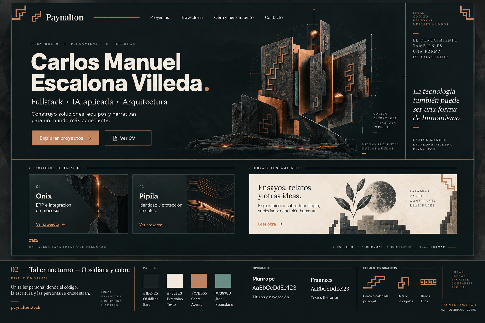

# Referencia para el rediseño de la Web CV de Paynalton

Dirección de contenido diseño y arquitectura

Carlos Manuel Escalona Villeda  |  paynalton.tech  
22 de septiembre de 2026  |  Versión 1

El rediseño presentará una experiencia fullstack actual, con IA aplicada, arquitectura de soluciones, liderazgo de equipos y conducción de proyectos. La literatura, la filosofía y los ensayos tendrán un espacio propio, conectado con el contenido profesional mediante una taxonomía común.

La dirección visual elegida es Taller nocturno, con obsidiana y cobre y adornos de inspiración prehispánica moderada. La base se mantiene en Astro con salida estática y alojamiento en Netlify. Este documento sirve como referencia para redactar, diseñar e implementar el sitio.

### Estado de las decisiones

| Estado | Alcance |
| --- | --- |
| Confirmado | Actualizar el perfil profesional; integrar obra y pensamiento; usar WebGL; mejorar SEO y accesibilidad; facilitar acceso a agentes; integrar LinkedIn, GitHub, Reddit y TikTok; relacionar contenidos mediante tags. |
| Dirección elegida | Taller nocturno con lenguaje de códice y grecas más reconocibles, sin saturación. La última imagen representa la guía de trabajo. |
| Propuesto | Modelo de contenido, navegación, exportaciones, herramientas WebMCP y mecanismos de actualización descritos aquí. Requieren concretarse durante la implementación. |
| Pendiente | Titular profesional definitivo, datos laborales actualizados, selección de obras y proyectos, rutas finales, alcance de automatizaciones y especificación móvil. |

### Cómo consultar este documento

Las páginas siguientes cubren posicionamiento, organización editorial, guía visual, WebGL, taxonomía, arquitectura y agentes, redes sociales, ejecución y fuentes. Las cifras de experiencia y los textos de las imágenes no deben copiarse automáticamente como contenido definitivo.

## Posicionamiento profesional y mercado

### Identidad que se quiere comunicar

Un desarrollador fullstack que participa en la construcción de software y puede definir arquitectura, coordinar equipos, planear el trabajo y conducir la entrega. La IA debe aparecer como una capacidad aplicada y respaldada por ejemplos. El título sugerido durante la conversación fue Senior Fullstack o Technical Lead, con arquitectura, IA y dirección de proyectos como ámbitos de experiencia; no se cerró un encabezado definitivo.

### Dos dimensiones de experiencia con IA

- Desarrollo con IA: análisis, diseño, implementación, pruebas y automatización con asistentes o agentes, explicando cómo se revisan sus resultados y se conserva el control técnico.

- Productos con IA: integración de modelos, herramientas o agentes en sistemas reales. Afirmar este alcance únicamente para proyectos que puedan documentarse.

### Señales observadas en vacantes

La exploración abarcó cinco anuncios de Oowlish, Lab49 y Kavak con ubicación en CDMX o contratación remota desde México. Es una muestra cualitativa consultada durante esta conversación, sin estimación del tamaño del mercado ni garantía de mejora salarial. Las vacantes pueden cambiar o cerrarse. Fuentes M1 a M5.

| Vacante | Señal relevante |
| --- | --- |
| Oowlish · Senior Full Stack con AI Focus | TypeScript, Node.js, React, AWS, entrega de punta a punta y uso cotidiano de IA. |
| Lab49 · Principal Full Stack | Combina programación, arquitectura, liderazgo, clientes y calidad. Pide inglés sólido. |
| Lab49 · Product and Delivery Manager | Planeación, riesgos, dependencias, seguimiento financiero y equipos; inglés C1+ e interés o experiencia práctica en IA. |
| Kavak · Senior to Staff | Sistemas de pagos, trazabilidad e integración. Valora SPEI y ERP; exige Java o Go. |
| Kavak · Senior AI Engineer | Agentes, evaluación, auditoría y controles deterministas; pide experiencia específica con modelos en producción. |

La recomendación es mostrar trabajo técnico reciente y evidencias de liderazgo. La obra escrita puede enriquecer la identidad y mostrar claridad de pensamiento; la muestra revisada no permite atribuirle una ventaja directa de contratación.

## Contenido y navegación

### Punto de partida

El sitio explorado contiene Inicio, Mi Vida, Mis Empleadores, Mis Proyectos, Mis Ideas y Contacto. La portada presenta Engineering Manager & Solution Architect; el PDF adjunto encabeza Fullstack Web Developer. La sección Mis Empleadores describe hábitos y filosofía de trabajo, por lo que su rótulo debe revisarse.

Se detectaron una lista extensa de tecnologías antes de la experiencia, fichas de proyectos con poca evidencia de impacto, traducciones incompletas y contenido duplicado en Ideas. El PDF señala SoDigital como empleo actual y la web muestra 2020–2025: confirmar la cronología antes de publicar. Los contadores de proyectos, usuarios y problemas necesitan sustento.

### Estructura editorial propuesta

| Sección | Contenido principal |
| --- | --- |
| Inicio | Nombre, especialidad, propuesta breve, proyectos seleccionados y accesos a CV y contacto. |
| Proyectos | Problema, contexto, participación, arquitectura, decisiones, tecnologías, resultados y enlaces de evidencia. |
| Trayectoria | Puestos, fechas verificadas, responsabilidades, alcance de equipos y proyectos asociados. |
| Obra y pensamiento | Literatura, filosofía, ensayos y divulgación; portadas, sinopsis, fragmentos, fechas y acceso a lectura. |
| Sobre mí | Historia, intereses, valores y forma de trabajar, con voz personal. |
| Contacto | Correo y canales profesionales, con una acción clara para iniciar una conversación. |

### Inventario inicial y reglas editoriales

Proyectos identificados: Onix, Winner, Delta, Delta Commerce, Pipila, K4Y y Holstein. La sección Ideas incluye, entre otros, Cuando la tostadora te responde, Aritmética con números indeterminados, ¿Qué es la inteligencia? y Dimensiones conectadas. Revisar títulos, clasificación, versiones y enlaces al preparar el inventario definitivo.

Priorizar ejemplos sobre descripciones genéricas de herramientas. Mantener una voz concreta, distinguir opiniones de resultados técnicos y permitir que la obra literaria tenga valor propio. Los CV para ingeniería y gestión pueden variar en énfasis sin alterar los hechos.

El selector observado ofrece ES, EN y NAH. Se comprobó el cambio a inglés. El adjunto yua.json contiene 213 entradas mayoritariamente en inglés; su función y la coherencia de los códigos de idioma deben verificarse en el repositorio.

## Guía visual elegida

Taller nocturno combina un estudio de ingeniería con una presentación editorial de la obra escrita. La elección deriva de Obsidiana y cobre, refinada para incorporar grecas escalonadas más definidas y relieves discretos en la estructura central.

Referencia visual seleccionada y refinada. Los textos, citas, imágenes de proyectos y detalles gráficos son orientativos; no constituyen contenido editorial aprobado.

### Paleta de referencia

| Color | Valor | Uso propuesto |
| --- | --- | --- |
| Obsidiana | #1D2425 | Fondo y superficies oscuras. |
| Pergamino | #F3EEE3 | Texto principal y áreas de lectura claras. |
| Cobre | #C78D65 | Acciones, detalles geométricos y acentos. |
| Jade | #73998D | Acento secundario de uso limitado. |

Las propuestas Papel y jade y Cuaderno abierto quedaron como alternativas exploradas. La dirección de implementación parte de Taller nocturno; la composición móvil y las páginas interiores se diseñarán a partir de este lenguaje.

## Sistema visual y experiencia WebGL

### Tipografía y composición

La guía propone Manrope para títulos y navegación y Fraunces para fragmentos literarios, con metadatos discretos. La selección final de fuentes debe comprobar legibilidad, caracteres en español, pesos disponibles y coste de carga. El nombre y la especialidad deben leerse antes que los adornos.

Usar una retícula editorial con espacio de descanso, separadores finos y jerarquía clara. Los proyectos necesitan capturas y diagramas propios; la biblioteca puede utilizar portadas y extractos. Evitar que todas las piezas adopten tarjetas idénticas o que las ilustraciones sugieran arquitectura física en lugar de software.

### Ornamentación prehispánica moderada

- Construir una familia coherente de grecas escalonadas, detalles de esquina y bandas cortas. Aplicarla en pocos puntos de la interfaz.

- Usar cobre en líneas e incrustaciones y relieves geométricos sobre la pieza oscura; reservar jade para detalles puntuales.

- Mantener limpia la superficie detrás del texto. Evitar calendarios, pirámides, máscaras o pseudoescritura añadidos como decoración genérica.

- La inspiración es contemporánea y abstracta. Cualquier motivo histórico concreto que se adopte debe documentarse y contextualizarse.

### Función de WebGL

Se propone una intervención principal: una estructura modular de planos oscuros y cobre, semejante a un códice desplegado. Podría revelar capas de interfaz, lógica, datos e infraestructura y conducir a proyectos relacionados. La coreografía exacta y la biblioteca gráfica permanecen pendientes.

- Conservar texto, enlaces y acciones en HTML. Mantener scroll normal y una ruta de navegación directa.

- Cargar la escena de forma diferida y detener el renderizado cuando quede fuera de vista. Ajustar calidad según dispositivo.

- Respetar movimiento reducido y ofrecer una composición estática cuando WebGL no esté disponible o resulte costoso.

- Evitar movimiento continuo detrás de textos y comprobar navegación por teclado y foco visible.

- Cargar reproductores sociales bajo demanda para que no compitan con la escena inicial.

El criterio de éxito es que la escena refuerce la identidad y la comprensión del trabajo sin impedir leer, contactar o descargar el CV. No se ha seleccionado un motor WebGL ni fijado un presupuesto de rendimiento.

## Taxonomía y relaciones entre contenidos

Se conservarán categorías diferenciadas y se añadirán etiquetas compartidas y relaciones explícitas. El tipo indica qué es una pieza; los términos indican sus temas y atributos; las relaciones explican cómo se conecta con otras entidades.

| Familia | Ejemplos | Qué expresa |
| --- | --- | --- |
| Temas | IA, identidad, pensamiento crítico | Asuntos tratados. |
| Tecnologías | AWS, Astro, TypeScript, Laravel | Herramientas utilizadas o discutidas. |
| Competencias | Arquitectura, liderazgo, planeación | Capacidades sustentadas por evidencia. |
| Sectores | Finanzas, comercio, educación | Contexto de aplicación. |
| Géneros | Ensayo, cuento, divulgación | Clasificación de obras escritas. |

Cada término tendrá un identificador estable, etiquetas por idioma, definición y alias. IA y AI pueden apuntar al mismo concepto. Se distinguirán las relaciones jerárquicas, como IA generativa dentro de inteligencia artificial, de las asociaciones entre conceptos, como arquitectura y sistemas distribuidos.

### Relaciones propuestas

| Origen | Relación | Destino |
| --- | --- | --- |
| Proyecto | utiliza | Tecnología |
| Proyecto | demuestra | Competencia |
| Ensayo | analiza | Tema |
| Publicación social | documenta | Proyecto u obra |
| Obra | amplía | Otra obra |
| Experiencia laboral | incluye | Proyecto |

Compartir un tag expresa afinidad, no experiencia demostrada. Un cuento sobre IA y un producto con IA pueden compartir tema; solo una implementación documentada sustenta esa competencia técnica. Las relaciones inferidas no deben presentarse como hechos confirmados.

### Modelo y salidas propuestos

Guardar por separado proyectos, experiencias, obras y términos. Cada pieza tendrá ID, tipo, título, idioma, resumen, fechas, URL, estado de publicación, referencias a términos, relaciones y evidencia cuando corresponda. Las traducciones compartirán identidad conceptual.

Durante la compilación se generarían páginas por término, enlaces relacionados con explicación, un índice JSON del grafo y versiones Markdown. Validar referencias inexistentes, IDs duplicados, ciclos jerárquicos y traducciones faltantes. Una base de datos de grafos no es necesaria para este alcance estático.

## Arquitectura SEO y acceso para agentes

### Base estática y fuente única

Mantener Astro con salida HTML estática en Netlify. Una fuente de contenido estructurado alimentará páginas, metadatos, JSON-LD y exportaciones. La interacción WebGL, filtros y búsqueda local puede ejecutarse en el navegador sin convertir el sitio en una aplicación con servidor permanente.

### SEO y accesibilidad

Proponer HTML semántico completo, títulos y descripciones por página, URLs estables, enlaces internos, sitemap, canonicals, idiomas y hreflang coherentes. Planificar redirecciones al cambiar rutas. Incorporar imágenes sociales, texto alternativo, teclado, foco, contraste y preferencias de movimiento. Estos aspectos requieren validación en móvil y escritorio.

### GEO y datos estructurados

GEO se planteó como facilitar descubrimiento, interpretación y cita en respuestas generativas. Google señala que sus funciones de IA utilizan las bases de SEO y no requieren archivos ni marcado especial; la inclusión y las recomendaciones no están garantizadas. Fuente T1.

Proponer JSON-LD con ProfilePage y Person para identificar a Carlos y Paynalton, enlazar perfiles públicos y describir obras y artículos con tipos pertinentes. Los datos deben coincidir con el contenido visible. Cada proyecto u obra debe tener una URL de origen y contexto suficiente para citarlo con precisión. Fuente T2.

### Formatos y herramientas para agentes

- Markdown y JSON públicos: exportar perfil, proyectos y obras desde la misma fuente que el HTML. Publicar únicamente información destinada al sitio.

- llms.txt: índice breve con contexto y enlaces a versiones legibles. Se incorpora como propuesta complementaria, sin promesa de posicionamiento. Fuente T3.

- WebMCP: explorar herramientas de consulta como buscar proyectos, consultar experiencia y localizar obras. Es un estándar propuesto y depende de clientes compatibles; no exige añadir un chatbot propio. Fuente T4.

- Rastreo: configurar acceso de buscadores y agentes conforme a una política explícita. OAI-SearchBot y GPTBot tienen finalidades distintas de búsqueda y entrenamiento. Fuente T5.

Prioridad propuesta: contenido accesible y verificable, SEO y datos estructurados; después exportaciones y llms.txt; finalmente una integración acotada de WebMCP. Consultar sus especificaciones vigentes al implementar.

## Integración con redes sociales

Las redes se vincularán a proyectos y obras para aportar evidencia y conversación. El contenido editorial permanecerá legible en el sitio, incluso si un embed deja de funcionar.

| Red | Función | Integración inicial propuesta |
| --- | --- | --- |
| LinkedIn | Trayectoria y liderazgo | Resúmenes propios de publicaciones seleccionadas, enlaces y opción de compartir contenido. |
| GitHub | Evidencia técnica | Repositorios seleccionados con descripción, tecnologías, documentación y fecha de actualización. |
| Reddit | Comunidad y discusión | Hilos o intervenciones vinculados con un tema, ensayo o proyecto. |
| TikTok | Demostración y divulgación | Videos seleccionados con resumen o transcripción y reproductor bajo demanda. |

### Actualización compatible con HTML estático

Mantener una selección editorial de URLs y metadatos en archivos del proyecto. Astro generará las páginas con esos registros. Para GitHub, consultar información pública durante la compilación y conservar un resultado utilizable si la API falla. Mostrar la fecha de actualización cuando sea relevante.

Si se utiliza un token, debe permanecer en el entorno de construcción y nunca incluirse en los archivos enviados al navegador. GitHub aplica límites de API; la frecuencia de consulta y compilación debe ajustarse al uso real. Fuente S2.

Una automatización externa podría disparar nuevas compilaciones mediante un build hook de Netlify. Esto mantiene el alojamiento estático; la automatización y el consumo de compilaciones se gestionan por separado. Fuente S5.

### Presentación e interacción

Cada ficha puede reunir la explicación del proyecto, repositorio, demostración en video y discusiones asociadas. Los embeds oficiales de Reddit y TikTok permiten mostrar piezas concretas; LinkedIn ofrece un mecanismo de compartir. Usar resúmenes en HTML y enlaces directos como alternativa. Fuentes S1, S3 y S4.

La sincronización completa de feeds y la publicación automática quedan para una etapa posterior. Su viabilidad depende de APIs, permisos, credenciales y políticas de cada plataforma. TikTok ofrece una Display API para perfiles y videos, cuyo acceso deberá evaluarse si se desea automatizar. Fuente S6.

La integración propuesta no supone publicar automáticamente ni vincular cuentas privadas. Faltan los perfiles definitivos y la selección de contenidos de cada red.

## Plan de trabajo y puntos por resolver

### Secuencia propuesta

| Etapa | Resultado esperado |
| --- | --- |
| 1  Inventario y datos | Confirmar cronología, puesto actual, alcance de experiencia, obras, enlaces y material que puede hacerse público. |
| 2  Modelo editorial | Definir categorías, términos, relaciones, idiomas y esquemas de validación. |
| 3  Diseño | Cerrar portada, móvil, proyectos, lectura y componentes del Taller nocturno; validar contraste y tipografía. |
| 4  Implementación estática | Construir HTML, rutas, navegación, metadatos y migración de URLs; incorporar contenido real. |
| 5  Experiencias complementarias | Añadir WebGL progresivo, redes, exportaciones y herramientas para agentes según prioridad. |
| 6  Verificación y publicación | Revisar rendimiento, accesibilidad, consistencia, enlaces y comportamiento sin servicios externos. |

### Decisiones pendientes

- Equilibrio final entre fullstack, liderazgo y gestión; titular de portada y variantes de CV.

- Fechas y responsabilidades laborales, años de experiencia por ámbito, tamaño de equipos y resultados demostrables.

- Selección de proyectos y obras; autoría, versiones y permisos de publicación de material de terceros o clientes.

- Idiomas que se mantendrán, códigos correctos y revisión de traducciones.

- Motor y comportamiento de WebGL, calidad móvil y alternativa estática.

- Perfiles sociales, actualización manual o automatizada y frecuencia de compilación.

- Alcance de WebMCP y política de rastreo para búsqueda y entrenamiento.

### Criterios de aceptación propuestos

Un reclutador debe identificar especialidad, experiencia y contacto sin explorar la escena 3D. Cada afirmación de competencia tendrá ejemplos. Los proyectos y obras estarán conectados por relaciones verificables. El contenido principal será legible sin JavaScript y tendrá rutas estables.

El sitio deberá funcionar con teclado, movimiento reducido y en móvil. HTML, Markdown y JSON compartirán los mismos hechos. La ausencia de un embed o de WebGL no bloqueará la lectura. Las comprobaciones de rendimiento y accesibilidad tendrán resultados registrados antes de publicar.

La conversación definió dirección y requisitos. No se han aplicado cambios al código ni desplegado una nueva versión. El siguiente trabajo concreto es revisar el repositorio y cerrar el inventario editorial con la guía visual como referencia.

## Fuentes y materiales de referencia

Estas fuentes sustentan la exploración realizada en la conversación. Las vacantes y especificaciones deben verificarse de nuevo al postular o implementar. Los adjuntos curricumlum.pdf y yua.json y el sitio público fueron materiales de diagnóstico; las imágenes generadas son referencias de diseño.

### Mercado laboral

[M1 · Oowlish · Senior Full Stack con AI Focus](https://jobs.lever.co/oowlish/d56664b8-6091-4614-91d6-0f59b276c24d)

[M2 · Lab49 · Principal Full Stack Engineer](https://jobs.lever.co/ion/8bc9ea9f-371b-46f7-8efe-4097377011e8)

[M3 · Lab49 · Product and Delivery Manager](https://jobs.lever.co/ion/63b11ab2-8181-494a-9c80-4e8eefdd5076)

[M4 · Kavak · Senior to Staff Software Engineer](https://jobs.lever.co/kavak/12685c53-fb11-476e-a20d-296b89fffa1d)

[M5 · Kavak · Senior AI Engineer](https://jobs.lever.co/kavak/115308ef-5a1e-4e7c-bace-5949ce47d590)

### SEO y agentes

[T1 · Google Search Central · Funciones de IA y sitios web](https://developers.google.com/search/docs/appearance/ai-features)

[T2 · Schema.org · ProfilePage](https://schema.org/ProfilePage)

[T3 · Propuesta llms.txt](https://llmstxt.org/)

[T4 · Chrome for Developers · WebMCP](https://developer.chrome.com/docs/ai/webmcp)

[T5 · OpenAI · Rastreadores](https://developers.openai.com/api/docs/bots)

### Redes y alojamiento

[S1 · LinkedIn · Share Plugin](https://learn.microsoft.com/en-us/linkedin/consumer/integrations/self-serve/plugins/share-plugin)

[S2 · GitHub · Límites de la API REST](https://docs.github.com/en/rest/using-the-rest-api/rate-limits-for-the-rest-api)

[S3 · Reddit · Inserción de publicaciones y comentarios](https://support.reddithelp.com/hc/en-us/articles/360043033532-How-do-I-embed-a-Reddit-post-or-comment-in-an-article-or-other-publication)

[S4 · TikTok · Videos insertados](https://developers.tiktok.com/docs/en/embed-videos)

[S5 · Netlify · Build hooks](https://docs.netlify.com/build/configure-builds/build-hooks/)

[S6 · TikTok · Display API](https://developers.tiktok.com/docs/en/display-api-overview)

[Sitio de partida · Paynalton](https://paynalton.tech/es/)
