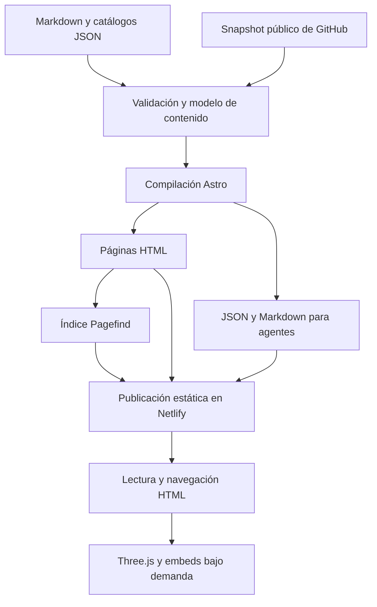

# Stack tecnológico para el rediseño de Paynalton

**Proyecto:** paynalton.tech  
**Versión del documento:** 1.0  
**Fecha:** 22 de septiembre de 2026  
**Estado:** propuesta técnica para revisión e implementación.

## 1. Objetivo y alcance

Construir la Web CV con la dirección visual **Taller nocturno**, integrar el perfil profesional y la obra escrita, y conectar ambos mediante categorías, taxonomía y relaciones explícitas. La experiencia incorporará WebGL, búsqueda, redes sociales y formatos legibles por agentes, manteniendo **Astro con salida estática y alojamiento en Netlify**.

Astro y Netlify son la base existente indicada por el propietario. Las bibliotecas y prácticas siguientes son recomendaciones; aún no se han contrastado con el `package.json`, el lockfile ni la configuración del repositorio. Este documento define el stack objetivo, no describe una implementación terminada.

Complementa la referencia del rediseño y el mapa de navegación. No establece una migración de proveedor ni requiere un servidor permanente, una base de datos o un modelo de IA ejecutándose en producción.

## 2. Stack recomendado

| Capa | Elección propuesta | Función | Dónde se ejecuta |
| --- | --- | --- | --- |
| Sitio | Astro con generación estática | Páginas, layouts, rutas y HTML semántico | Compilación |
| Lenguaje | TypeScript con comprobación estricta | Lógica de contenido, herramientas y controles interactivos | Compilación y módulos de navegador |
| Componentes | Componentes `.astro` y módulos TypeScript | Interfaz y comportamiento localizado | HTML generado y navegador |
| Estilos | CSS propio, custom properties, Grid y Flexbox | Sistema visual Taller nocturno y adaptación móvil | Navegador |
| Contenido | Markdown con frontmatter; JSON para catálogos | Proyectos, trayectoria, obras, términos y referencias sociales | Repositorio y compilación |
| Validación de contenido | Content Collections de Astro y esquemas Zod compatibles | Tipos, campos y referencias | Compilación |
| Taxonomía | Módulo TypeScript y grafo JSON generado | Jerarquías, relaciones y consultas | Compilación; lectura en navegador |
| Escena 3D | Three.js | WebGL de la portada | Navegador, con carga diferida |
| Gráficos planos | SVG propios y CSS | Grecas, iconos, divisores y diagramas simples | Navegador |
| Búsqueda | Pagefind | Índice estático, búsqueda y filtros | Indexación posterior al build; consulta en navegador |
| SEO | Layout de metadatos y `@astrojs/sitemap` | Canonicals, idiomas, metadatos y sitemap | Compilación |
| Agentes | Markdown, JSON, JSON-LD y `llms.txt` | Lectura y descubrimiento del contenido | Archivos estáticos |
| Interacción con agentes | WebMCP, experimental y opcional | Consultas estructuradas a contenidos públicos | Navegador compatible |
| Alojamiento | Netlify | Distribución de archivos y configuración de rutas | Plataforma de alojamiento |
| Calidad | `astro check`, Playwright, axe y Lighthouse | Tipos, recorridos, accesibilidad y rendimiento | Desarrollo y CI |
| Versionado | Git y repositorio existente | Historial de código, contenido y configuración | Desarrollo y CI |

La elección de paquetes se validará con las versiones compatibles de Astro y Node.js. Se conservará el gestor de paquetes del proyecto si es adecuado; si no existe una convención, npm es una opción inicial. Habrá un único lockfile versionado.

## 3. Arquitectura de ejecución

La distinción principal es entre la construcción del sitio y lo que necesita el visitante. Las credenciales de una integración pertenecen al proceso de construcción o a un servicio autorizado, nunca al JavaScript público.

| Funcionalidad | Se resuelve estáticamente | Límite relevante |
| --- | --- | --- |
| Páginas y términos | Sí, generados en la compilación | Los cambios editoriales requieren reconstrucción |
| Búsqueda Pagefind | Sí, índice y consulta local | Requiere JavaScript para buscar; los listados HTML siguen disponibles |
| WebGL | Sí, con recursos y código estáticos | Depende del dispositivo y del soporte gráfico |
| Exportaciones JSON y Markdown | Sí | Son instantáneas del contenido publicado |
| Embeds sociales | Sí en la página anfitriona | Su reproductor o contenido depende de la plataforma externa |
| Actualización automática de GitHub | Durante el build o mediante un proceso previo | Necesita acceso de red, límites controlados y política de fallos |
| Consultas WebMCP de solo lectura | Posibles en el navegador | Requieren un agente y navegador compatibles |
| Publicación en redes o chat generativo | No como funcionalidad autónoma de archivos estáticos | Requieren servicios, autenticación o infraestructura adicional |

Astro puede generar archivos desde endpoints estáticos. Una ruta como `/data/content-index.json` es un archivo servido por la CDN, no una API con procesamiento por petición. [Endpoints de Astro](https://docs.astro.build/en/guides/endpoints/)

## 4. Astro y componentes de interfaz

### Configuración base

- Mantener la salida estática y generar las rutas públicas durante el build.
- Usar componentes Astro para cabecera, navegación, fichas, páginas de lectura y relaciones entre contenidos.
- Añadir JavaScript únicamente donde exista interacción: menú móvil, filtros, búsqueda, preferencias y escena.
- Usar TypeScript estricto y comprobación de tipos como paso separado de la compilación.
- Mantener la navegación convencional en la primera entrega. Si se incorporan transiciones entre páginas, probar la destrucción y reinicialización de escenas, búsqueda y embeds.

No se propone añadir React o Vue exclusivamente para la portada. Si el repositorio ya utiliza uno y existen componentes útiles, evaluar su reutilización como islas antes de retirarlo. La decisión debe basarse en complejidad, mantenimiento y JavaScript enviado.

### Despliegue en Netlify

Un sitio Astro estático puede desplegarse en Netlify sin un adaptador de servidor. Añadir `@astrojs/netlify` solo si una función concreta requiere las capacidades de esa integración. El build completo debe incluir la indexación de Pagefind y publicar el directorio de salida configurado, normalmente `dist`. [Astro en Netlify](https://docs.astro.build/en/guides/deploy/netlify/)

Revisar la configuración existente antes de cambiar comandos o rutas. No añadir una redirección general a `index.html` propia de una SPA: cada URL editorial tendrá su documento y los errores reales conservarán respuesta 404.

## 5. Sistema visual y recursos

### CSS y diseño

CSS propio con variables para colores, tipografía, espaciado, radios, bordes, niveles de superposición y movimiento. Grid y Flexbox resolverán la retícula editorial. Los puntos de ruptura responderán al contenido, con verificación en pantallas pequeñas y ampliación de texto.

| Token conceptual | Valor inicial | Uso |
| --- | --- | --- |
| Fondo obsidiana | `#1D2425` | Fondo principal |
| Texto pergamino | `#F3EEE3` | Texto claro y superficies de lectura |
| Acento cobre | `#C78D65` | Acciones y grecas |
| Acento jade | `#73998D` | Detalles secundarios |

Los colores son la referencia visual, no una validación de contraste. Cada combinación real de texto, fondo, borde y estado de foco debe comprobarse.

Manrope y Fraunces son candidatas de la guía visual. Confirmar disponibilidad, licencia, caracteres necesarios y pesos; preferir archivos WOFF2 alojados con el sitio. Precargar solamente fuentes esenciales y proporcionar fuentes de sistema alternativas.

Las grecas y ornamentos se crearán como SVG reutilizables. Los adornos puramente decorativos se excluirán del árbol de accesibilidad. La imagen generada del Taller nocturno es una referencia de composición: la web tendrá texto y componentes reales.

### Imágenes y movimiento

Preparar imágenes responsivas con dimensiones explícitas. Evaluar `astro:assets` conforme a la versión elegida y conservar la optimización en compilación donde corresponda. Usar formatos comprimidos adecuados y carga diferida bajo la primera pantalla.

Resolver transiciones simples con CSS o Web Animations API. Una biblioteca adicional de animación solo se justifica si la coreografía elegida supera claramente estas capacidades.

## 6. Three.js y WebGL

**Elección propuesta:** Three.js mediante un módulo TypeScript independiente, importado dinámicamente. El renderer concreto se fijará con la versión seleccionada y los navegadores objetivo; WebGPU no será requisito para leer el sitio. [Documentación de Three.js](https://threejs.org/docs/)

La escena representará planos oscuros y cobre, relieves de grecas y un códice modular. El objeto puede construirse inicialmente con geometría procedural. Si la dirección artística requiere modelado externo, usar Blender como herramienta de autoría y exportar GLB/glTF optimizado; no es una dependencia del navegador.

### Ciclo de vida

1. Entregar primero el HTML y una imagen estática representativa.
2. Comprobar preferencias de movimiento y posibilidad de crear el contexto gráfico.
3. Cargar la escena cuando sea pertinente, sin retrasar el contenido principal.
4. Limitar resolución efectiva y calidad según el dispositivo.
5. Pausar el bucle cuando la pestaña esté oculta o la escena fuera de vista.
6. Liberar geometrías, materiales, texturas y listeners al desmontar.
7. Conservar la alternativa estática si hay error o pérdida de contexto.

El movimiento reducido usará por defecto la composición estática. Todo destino disponible desde la escena tendrá un enlace HTML equivalente. La literatura se leerá sin animación continua detrás del texto.

## 7. Contenido y taxonomía

### Fuente editorial

Utilizar Markdown con frontmatter para textos largos y JSON para catálogos pequeños. Incorporar MDX solamente si una pieza necesita componentes dentro del cuerpo y se define también cómo exportarla de forma legible a Markdown.

Las Content Collections permiten organizar contenido con esquemas y referencias. Adoptar su API de compilación compatible con la versión finalmente fijada. [Content Collections](https://docs.astro.build/en/guides/content-collections/)

| Colección | Contenido |
| --- | --- |
| `projects` | Casos de estudio y evidencia técnica |
| `experience` | Puestos, fechas, responsabilidades y alcance |
| `works` | Literatura, filosofía, ensayos y divulgación |
| `terms` | Temas, tecnologías, competencias, sectores y géneros |
| `social` | Publicaciones externas seleccionadas |
| `profile` | Identidad pública, presentación y contacto |

### Identidad y relaciones

Separar el ID conceptual del idioma y del slug. Una traducción mantiene la relación con la misma entidad, aunque su ruta o título cambien. Los términos tendrán familia, etiquetas por idioma, definición, alias y vínculos jerárquicos o asociativos.

Representar relaciones con `source`, `predicate`, `target` y, cuando corresponda, una referencia de evidencia. Vocabulario inicial: `uses`, `demonstrates`, `analyzes`, `documents`, `expands` e `includes`. Son convenciones internas propuestas, no propiedades estándar de Schema.org.

El generador TypeScript resolverá relaciones inversas y contenidos relacionados. Usar primero vínculos editoriales explícitos y después afinidades por etiquetas, mostrando el motivo de la recomendación. No inferir experiencia técnica a partir de un ensayo o una etiqueta compartida.

### Validaciones

- IDs y rutas únicos; términos y destinos existentes.
- Fechas coherentes y campos requeridos completos.
- Jerarquías sin ciclos; etiquetas relacionadas diferenciadas de equivalencias.
- Traducciones vinculadas correctamente y ausencias tratadas de forma explícita.
- Borradores excluidos de páginas, búsqueda, sitemap y todas las exportaciones.
- Evidencias y URLs públicas asociadas a afirmaciones profesionales.

El catálogo y las relaciones pueden resolverse en memoria durante el build. Neo4j, una base vectorial y un servicio de embeddings quedan fuera del stack inicial.

## 8. Idiomas y búsqueda

### Internacionalización

Usar rutas prefijadas por idioma y un diccionario de interfaz separado del contenido. Aplicar la configuración i18n de Astro cuando sea útil y un mapa de traducciones para resolver enlaces entre piezas. Verificar códigos de idioma, en especial la opción NAH y el archivo `yua.json`, antes de migrar datos. [Internacionalización de Astro](https://docs.astro.build/en/guides/internationalization/)

Las traducciones ausentes no deben generar `hreflang` a páginas inexistentes ni mostrar otro idioma silenciosamente. Se conserva el mapa de rutas propuesto en el documento de navegación.

### Pagefind

Generar el índice después de crear el HTML. Indexar el cuerpo útil de cada pieza, con filtros por tipo, términos e idioma, evitando que cabecera, pie o texto repetido dominen los resultados. Pagefind permite búsqueda estática y filtros mediante metadatos del contenido. [Inicio](https://pagefind.app/docs/), [Filtros](https://pagefind.app/docs/filtering/)

Integrar la interfaz con los estilos del sitio. La página Explorar puede requerir JavaScript para buscar; las páginas por categoría y término proporcionarán navegación HTML alternativa. Pagefind no se presentará como búsqueda semántica ni como motor de inferencia del grafo.

## 9. SEO GEO y formatos para agentes

### SEO y datos estructurados

Implementar un componente de metadatos compartido: título, descripción, canonical, Open Graph, idioma y alternativas reales. Generar sitemap con `@astrojs/sitemap`, filtrando borradores y rutas que no deban indexarse. [Integración sitemap](https://docs.astro.build/en/guides/integrations-guide/sitemap/)

Usar JSON-LD con tipos adecuados, por ejemplo `Person`, `ProfilePage`, `Article`, `Book` y `BreadcrumbList`, cuando representen fielmente la página. Los términos pueden describirse con `DefinedTerm` y `DefinedTermSet` tras validar su modelado. Mantener las relaciones internas propias en el grafo JSON; no introducir propiedades inventadas en Schema.org.

### Exportaciones propuestas

| Archivo o ruta | Propósito |
| --- | --- |
| `/llms.txt` | Índice breve y enlaces a contenido público |
| `/data/content-index.json` | Catálogo resumido por entidad e idioma |
| `/data/taxonomy.json` | Términos, familias, alias y jerarquías |
| `/data/relations.json` | Relaciones tipadas con referencias de origen |
| `/{idioma}/.../{slug}/index.md` | Representación textual de cada pieza, según la convención final |
| `/robots.txt` y sitemap | Rastreo y descubrimiento |

Son rutas propuestas, generadas a partir del mismo modelo que el HTML. Los JSON tendrán `schemaVersion`, fecha de generación y URLs de origen. Asegurar orden determinista y exportar únicamente campos públicos. Las versiones Markdown enlazarán imágenes y recursos con URLs utilizables fuera del sitio.

GEO no requiere instalar un SDK de IA. Google indica que sus funciones generativas mantienen las bases de SEO y no exigen archivos especiales; `llms.txt` se añade como recurso complementario. Su presencia no garantiza recomendaciones ni citas. [Google](https://developers.google.com/search/docs/appearance/ai-features), [Propuesta llms.txt](https://llmstxt.org/)

### WebMCP

Integración experimental mediante un módulo aislado y detección de soporte, siguiendo la API oficial vigente al implementarlo. Las funciones inicialmente propuestas son consultas de solo lectura: `searchContent`, `getProject`, `getExperience` y `getRelatedContent`. Los nombres son internos y están por cerrar.

Cada función validará parámetros, limitará resultados y devolverá enlaces a evidencias públicas. Puede consultar archivos estáticos o índices locales; no necesita enviar datos a un modelo ni exponer secretos. La web funciona aunque el cliente no tenga WebMCP. Esta integración en navegador es distinta de operar un servidor MCP remoto. [WebMCP](https://developer.chrome.com/docs/ai/webmcp)

## 10. Integraciones sociales

| Plataforma | Implementación propuesta | Actualización |
| --- | --- | --- |
| LinkedIn | Selección editorial de publicaciones, enlaces y compartir | Al editar el contenido |
| GitHub | REST API durante sincronización; snapshot público seleccionado | Build o automatización controlada |
| Reddit | Enlaces y embeds oficiales de intervenciones elegidas | Selección editorial; embed depende del origen |
| TikTok | Videos elegidos con resumen o transcripción y embed bajo demanda | Selección editorial; API solo si se habilita posteriormente |

La sincronización GitHub utilizará un script Node.js/TypeScript. La biblioteca cliente es opcional: `fetch` resulta suficiente para un conjunto pequeño de endpoints; añadir Octokit solo si aporta valor a la complejidad real de la integración.

Guardar una instantánea persistente y su fecha, con datos públicos permitidos. Un archivo versionado puede servir de respaldo; una caché temporal del build por sí sola no garantiza continuidad. Si la API falla, reutilizar el snapshot válido y registrar que no se actualizó; si no existe, omitir esa información secundaria sin romper el contenido editorial.

No se propone scraping de perfiles. Sincronizar feeds completos o publicar automáticamente requiere evaluar permisos y políticas por separado. Los embeds se cargarán tras interacción y mantendrán un enlace externo alternativo.

Referencias: [GitHub REST](https://docs.github.com/en/rest/using-the-rest-api/rate-limits-for-the-rest-api), [LinkedIn Share](https://learn.microsoft.com/en-us/linkedin/consumer/integrations/self-serve/plugins/share-plugin), [Reddit Embeds](https://support.reddithelp.com/hc/en-us/articles/360043033532-How-do-I-embed-a-Reddit-post-or-comment-in-an-article-or-other-publication), [TikTok Embed](https://developers.tiktok.com/docs/en/embed-videos).

## 11. Repositorio y compilación

### Organización sugerida

| Ubicación conceptual | Responsabilidad |
| --- | --- |
| `src/content/` | Markdown y registros editoriales |
| `src/content.config.ts` | Configuración de colecciones, si corresponde a la versión elegida |
| `src/data/` | Catálogos, rutas, perfil y snapshots públicos |
| `src/components/` | Componentes Astro reutilizables |
| `src/layouts/` | Layouts de página, lectura y metadatos |
| `src/pages/` | Rutas y generadores de archivos estáticos |
| `src/lib/content/` | Consultas, taxonomía y resolución de relaciones |
| `src/scripts/` | Búsqueda, menú, embeds y registro WebMCP |
| `src/scripts/webgl/` | Escena, materiales y ciclo de vida |
| `src/styles/` | Tokens, bases y estilos editoriales |
| `public/` | Archivos que se copian sin procesar |
| `scripts/` | Sincronización, validación y tareas de construcción |
| `tests/` | Pruebas relevantes de contenido y recorridos |

Adaptar las rutas al repositorio existente. Los archivos generados no se editarán manualmente; registrar claramente qué fuente los produce.

### Pipeline propuesto

1. Instalar dependencias desde el lockfile con el runtime fijado.
2. Sincronizar datos externos solo en el contexto autorizado; conservar respaldo.
3. Validar contenido, grafo y tipos.
4. Generar páginas, datos estructurados, Markdown, JSON y sitemap con Astro.
5. Ejecutar Pagefind sobre la salida HTML.
6. Comprobar enlaces, rutas y exclusión de borradores; ejecutar pruebas representativas.
7. Publicar una vista previa y validar la experiencia visual.
8. Desplegar producción mediante el flujo del repositorio y Netlify.

Conservar el proveedor de CI existente. GitHub Actions es una opción si el repositorio está allí y se necesita sincronización programada. Netlify puede construir desde Git; una tarea externa también puede invocar un build hook. No duplicar builds completos innecesariamente. Los build hooks son secretos operativos y no se publican en el cliente. [Netlify Build hooks](https://docs.netlify.com/build/configure-builds/build-hooks/)

## 12. Validación y rendimiento

### Herramientas y alcance

| Herramienta | Uso |
| --- | --- |
| `astro check` | Errores de tipos y componentes |
| Validadores de contenido | Integridad del grafo, rutas, traducciones y exportaciones |
| Playwright | Menú, idioma, filtros, CV, contacto y rutas críticas |
| `@axe-core/playwright` | Detección automática de problemas de accesibilidad |
| Lighthouse | Diagnóstico de carga, accesibilidad y SEO |
| Revisión manual | Teclado, lector de pantalla, zoom, móvil, movimiento y claridad visual |

Objetivo propuesto: **WCAG 2.2 nivel AA**. Los resultados automáticos no constituyen certificación ni reemplazan pruebas manuales. [WCAG 2.2](https://www.w3.org/TR/WCAG22/), [Playwright y axe](https://playwright.dev/docs/accessibility-testing), [Lighthouse](https://developer.chrome.com/docs/lighthouse/overview)

### Presupuestos iniciales propuestos

Son límites de diseño para validar en el prototipo, no mediciones del sitio actual ni cifras normativas.

- HTML, CSS y JavaScript crítico de la portada: objetivo conjunto de hasta 200 KB transferidos y comprimidos, excluyendo fuentes e imágenes.
- Imagen alternativa del hero: objetivo de hasta 250 KB en la variante móvil.
- Three.js y recursos de escena: carga diferida separada; objetivo inicial conjunto de hasta 1,5 MB transferidos.
- Embeds sociales: ninguna descarga de reproductores antes de la interacción prevista.
- Escena: sin renderizado continuo fuera de vista; ajustar calidad si no mantiene una interacción fluida en el móvil de referencia.

Registrar dispositivo, conexión, caché y condiciones de cada medición. Si la escena excede el presupuesto, reducir geometría, texturas o materiales antes de ampliar dependencias. La primera lectura y los botones principales no esperarán al 3D.

Probar también JavaScript desactivado, error de API social, movimiento reducido, pérdida de contexto gráfico y cambio de idioma hacia una pieza sin traducción.

## 13. Configuración operativa

Fijar una versión de Node.js mantenida y compatible con Astro en desarrollo, CI y Netlify. Guardar los requisitos en la configuración del repositorio y evitar comandos que descarguen versiones no fijadas durante cada build.

Configurar redirecciones de URLs antiguas, página 404, cabeceras y caché conforme a los recursos publicados. Los assets con hash pueden tener caché larga; HTML e índices deben actualizarse coherentemente con cada despliegue.

Separar permisos del build de producción y vistas previas. Ningún prefijo o variable pública debe contener tokens. Revisar también logs y archivos generados. Los secretos para sincronización no se exponen a contribuciones no confiables.

La medición inicial puede apoyarse en Search Console y diagnósticos de carga. La herramienta de analítica de visitas y eventos queda pendiente; decidir qué se medirá y el servicio antes de incorporarlo. El contacto inicial puede usar correo y enlaces: un formulario implicaría elegir un procesador externo o servicio específico.

## 14. Dependencias opcionales y decisiones pendientes

| Elemento | Estado y criterio |
| --- | --- |
| React o Vue | Reutilizar si ya existen y aportan valor; no requisito de la propuesta |
| Tailwind o framework de UI | CSS propio como base; evaluar lo existente antes de migrar |
| MDX | Solo para contenidos que requieran componentes interactivos |
| Blender y GLB/glTF | Autoría opcional si la geometría procedural no alcanza el resultado visual |
| Librería de animación | Incorporar únicamente por una necesidad concreta de coreografía |
| Adaptador Netlify y Functions | Solo si se aprueban capacidades que necesiten ejecución de servidor |
| CMS | Fuera de la primera entrega; reconsiderar si la edición por archivos resulta insuficiente |
| API de TikTok y feeds completos | Requieren evaluación de permisos, costes y mantenimiento |
| WebMCP | Experimental, con detección de soporte y alternativa de lectura estática |
| Chatbot o RAG | Fuera del alcance inicial; no necesarios para GEO ni exportaciones |
| Base de datos o embeddings | Fuera del stack inicial |

Antes de instalar: revisar repositorio y dependencias, fijar versiones compatibles, confirmar idiomas, preparar una prueba de Three.js en móvil, validar filtros de Pagefind y definir qué datos de GitHub se sincronizarán.

## 15. Criterio para aprobar el stack

La propuesta estará lista para implementación cuando exista un build reproducible, una muestra de contenido validado, una escena con alternativa estática y un catálogo con búsqueda funcional. HTML, JSON y Markdown deberán publicar los mismos hechos, excluyendo borradores. El diseño conservará la identidad del Taller nocturno sin depender de efectos para navegar.

El núcleo recomendado es **Astro + TypeScript + CSS propio + Markdown/JSON + Three.js + Pagefind + Netlify**, con exportaciones para agentes y WebMCP como ampliación experimental.
