# Propuesta gráfica formal — Paynalton

Taller nocturno · Versión 1.0 · Documento de diseño para revisión.

## Taller nocturno

Propuesta gráfica integral para paynalton.tech. Versión 1.0. Documento de diseño para revisión; reúne las decisiones y los estudios existentes, sin convertir las muestras en funcionalidades publicadas.

Referencia de dirección artística. Sus textos, botones y orden de proyectos son orientativos; prevalecen las decisiones editoriales y de accesibilidad posteriores.

La experiencia presenta la capacidad de construir software, definir soluciones y conducir equipos, junto con una voz propia en literatura y pensamiento. Una entrada memorable conduce a proyectos, lectura y contacto sin imponer el movimiento como requisito.

## 01 · Dirección y objetivos

| Objetivo del sitio | Respuesta del diseño |
| --- | --- |
| Mostrar experiencia técnica y capacidad de conducción | Proyectos destacados antes de listados extensos de herramientas; fichas que distinguen contexto, aportación y decisiones. |
| Facilitar una conversación profesional | Acción principal reconocible, correo accesible y enlaces públicos con propósito claro. |
| Dar un lugar propio a obra y pensamiento | Superficies de pergamino, ritmo editorial, índice y lectura sin distracciones. |
| Relacionar experiencia, capacidades e ideas | Taxonomía común y enlaces explicados; las relaciones no dependen de un grafo. |
| Transmitir identidad y cuidado | Obsidiana, cobre y grecas moderadas; escena del taller como único protagonista visual animado. |

El taller reúne planos, uniones y materiales como metáfora de construcción. Las grecas aparecen como remates de identidad, con espacio a su alrededor. Los ornamentos no compiten con nombres, titulares ni acciones. Las imágenes de proyectos se incorporan cuando aportan evidencia; no se exige ilustrar cada tarjeta.

El alcance actual trabaja en español, con salida estática de Astro y recursos propios. Las interacciones se resuelven en el navegador o durante la construcción del sitio; no se incorporan servicios externos de pago ni procesamiento de servidor requerido por estas funciones.

Se conservan Pipila, Onix y GUACAMAYA como destacados. Reckitt y Mead Johnson pueden nombrarse; la autorización no se extiende automáticamente a logotipos, capturas privadas ni otros clientes. La biblioteca será configurable y utiliza ejemplos durante el desarrollo. Alma y Blanco, negro y gris permanecen fuera de publicación. El CV se actualizará y generará después de terminar el sitio.

## 02 · Sistema visual y composición

| Elemento | Criterio de diseño |
| --- | --- |
| Identidad | Marca tipográfica y greca escalonada. Ornamentos concentrados en cabecera, remates y escena; no en cada párrafo. |
| Tipografía de interfaz | Manrope como dirección para navegación, títulos profesionales y texto funcional; pesos limitados y fuentes servidas localmente al implementar. |
| Voz editorial | Fraunces para títulos, fragmentos y acentos literarios. La lectura extensa debe probarse con textos reales antes de cerrar peso y tamaño. |
| Fuentes de las muestras | Atkinson local y Georgia son sustitutas de prototipado. Las capturas no acreditan la integración de Manrope y Fraunces. |
| Retícula | Dos zonas en la portada de escritorio: mensaje y escena. Catálogos en columnas; cronología vertical; texto largo en una columna de lectura. |
| Escala propuesta para implementación | Cuerpo 16–18 px; lectura 18–20 px con interlínea 1,65–1,85; ancho de lectura orientativo 60–75 caracteres. Titulares fluidos, sin truncamiento. |
| Espaciado propuesto | Ritmo base de 8 px, con pasos de 16, 24, 32, 48 y 64 px. Ajustar por jerarquía y contenido, no por llenar el espacio. |
| Móvil | Una columna, mensaje antes de escena, controles apilados e índice antes del texto. Tamaños táctiles de diseño de al menos 44 × 44 px; probar también zoom y 320 px de ancho. |
| Iconografía | Familia SVG sobre retícula de 24 × 24; trazo coherente, etiquetas para acciones ambiguas y nombre accesible para controles solo con icono. |

Las medidas de este apartado son una propuesta de normalización para la implementación. No describen una migración ya aplicada a los prototipos. El criterio es conservar la jerarquía al cambiar contenido, tamaño de pantalla o preferencias de movimiento.

## 03 · Color por función y accesibilidad

La identidad conserva obsidiana, pergamino, cobre y jade. La especificación vigente contiene 42 nombres semánticos RGBA, incluidas las dos variantes añadidas tras validar fondos tintados. El color se elige por su uso y por el fondo real, no por cercanía visual con una muestra.

| Regla | Aplicación obligatoria |
| --- | --- |
| Texto sobre oscuro | texto-principal, texto-secundario y texto-discreto en las superficies opacas validadas. No reducir opacidad del contenedor. |
| Texto sobre pergamino | texto-lectura y titulo-lectura; enlaces con enlace-claro y subrayado permanente. |
| Selección y tintes | texto-sobre-seleccion reemplaza texto-discreto; enlace-sobre-tinte reemplaza enlace-oscuro. No apilar tintes arbitrariamente. |
| Botones | Texto oscuro sobre cobre. Sobre pergamino añadir borde enlace-claro cuando la silueta sea necesaria para identificar el control. |
| Estados | Texto o símbolo comprensible además del color; colores claros de estado solo en sus paneles oscuros comprobados. |
| Foco | Contorno de 2 px con separación de 4 px, claro sobre oscuro y oscuro sobre pergamino; comprobar que no quede recortado u oculto. |
| Decoración | Jade original y bordes ornamentales no sustituyen los colores de texto ni los límites funcionales. |

La validación automática registra 84/84 combinaciones autorizadas que alcanzan sus umbrales de contraste y ocho usos no autorizados. Es una comprobación de pares de color conforme a los criterios de contraste WCAG 2.2 AA, no una certificación de accesibilidad del sitio. Las capturas históricas preceden a esta corrección y conservan su aspecto original.

[Paleta completa y usos](../propuesta_grafica_layouts/Propuesta_esquema_colores_RGBA.md) · [Muestrario actualizado](../propuesta_grafica_layouts/Paleta_colores_RGBA.html) · [Informe WCAG](../propuesta_grafica_layouts/Validacion_WCAG_paleta.md).

### Valores RGBA

| Uso | Valor |
| --- | --- |
| `fondo-pagina` | `rgba(16, 24, 25, 1)` |
| `fondo-principal` | `rgba(29, 36, 37, 1)` |
| `fondo-superficie` | `rgba(38, 50, 52, 1)` |
| `fondo-lectura` | `rgba(243, 238, 227, 1)` |
| `fondo-campo` | `rgba(16, 24, 25, 1)` |
| `fondo-seleccion` | `rgba(115, 153, 141, 0.16)` |
| `velo-modal` | `rgba(7, 12, 13, 0.76)` |
| `texto-principal` | `rgba(243, 238, 227, 1)` |
| `texto-secundario` | `rgba(184, 194, 186, 1)` |
| `texto-discreto` | `rgba(152, 167, 157, 1)` |
| `texto-lectura` | `rgba(65, 75, 67, 1)` |
| `titulo-lectura` | `rgba(29, 36, 37, 1)` |
| `enlace-oscuro` | `rgba(199, 141, 101, 1)` |
| `enlace-claro` | `rgba(128, 82, 52, 1)` |
| `texto-sobre-seleccion` | `rgba(184, 194, 186, 1)` |
| `enlace-sobre-tinte` | `rgba(217, 164, 126, 1)` |
| `texto-sobre-accion` | `rgba(16, 24, 25, 1)` |
| `accion-principal` | `rgba(199, 141, 101, 1)` |
| `accion-principal-hover` | `rgba(217, 164, 126, 1)` |
| `accion-principal-presionada` | `rgba(184, 121, 81, 1)` |
| `accion-secundaria-fondo` | `rgba(199, 141, 101, 0.08)` |
| `foco-sobre-oscuro` | `rgba(243, 238, 227, 1)` |
| `foco-sobre-claro` | `rgba(29, 36, 37, 1)` |
| `control-deshabilitado-fondo` | `rgba(57, 68, 66, 1)` |
| `control-deshabilitado-texto` | `rgba(157, 170, 160, 1)` |
| `borde-decorativo` | `rgba(199, 141, 101, 0.3)` |
| `borde-control` | `rgba(126, 145, 133, 1)` |
| `borde-lectura` | `rgba(186, 172, 151, 1)` |
| `acento-greca` | `rgba(199, 141, 101, 1)` |
| `acento-jade` | `rgba(115, 153, 141, 1)` |
| `texto-jade` | `rgba(166, 201, 175, 1)` |
| `sombra-superficie` | `rgba(0, 0, 0, 0.24)` |
| `sombra-escena` | `rgba(0, 0, 0, 0.42)` |
| `brillo-cobre` | `rgba(217, 164, 126, 0.22)` |
| `estado-exito` | `rgba(166, 201, 175, 1)` |
| `estado-exito-fondo` | `rgba(115, 153, 141, 0.12)` |
| `estado-advertencia` | `rgba(224, 188, 118, 1)` |
| `estado-advertencia-fondo` | `rgba(224, 188, 118, 0.1)` |
| `estado-error` | `rgba(237, 170, 163, 1)` |
| `estado-error-fondo` | `rgba(237, 170, 163, 0.1)` |
| `estado-informacion` | `rgba(169, 201, 218, 1)` |
| `estado-informacion-fondo` | `rgba(169, 201, 218, 0.1)` |

## 04 · Arquitectura de la experiencia

La navegación principal agrupa Proyectos, Trayectoria, Obra y pensamiento, Sobre mí y Contacto. La marca vuelve a Inicio; búsqueda y temas ofrecen recorridos transversales. Las rutas siguientes son destinos propuestos de productivo, no confirmación de despliegue.

| Layout | Propósito | Destino propuesto |
| --- | --- | --- |
| L0 · Base compartida | Contexto | Marco común; no crea una ruta |
| L1 · Inicio | Presentación y escena del taller | https://paynalton.tech/es/ |
| L2 · Catálogo de proyectos | Contexto | https://paynalton.tech/es/proyectos/ |
| L2-obra · Catálogo de obras | Contexto | https://paynalton.tech/es/obra/ |
| L2-explorar · Explorar y buscar | Contexto | https://paynalton.tech/es/explorar/ |
| L3 · Caso de proyecto | Contexto | https://paynalton.tech/es/proyectos/{slug}/ |
| L4 · Trayectoria profesional | Contexto | https://paynalton.tech/es/trayectoria/ |
| L5 · Publicación y lectura | Contexto | Ruta de cada obra; conservar /es/books/cuando-la-tostadora-te-responde/ |
| L6 · Tema y relaciones | Contexto | https://paynalton.tech/es/temas/{slug}/ |
| L7 · Sobre mí | Contexto | https://paynalton.tech/es/sobre-mi/ |
| L8 · Contacto | Contexto | https://paynalton.tech/es/contacto/ |

Se proponen tres recorridos principales: Inicio → proyecto → contacto; Inicio → trayectoria → evidencia; Inicio → obra → lectura → contenido relacionado. La obra conserva valor propio y no se reduce a una pieza del CV. Se mantienen las descargas y enlaces públicos existentes que deban preservarse según el mapa de rutas.

[Mapa de navegación](../Mapa_navegacion_Paynalton.md) · [Rutas y contenidos](../Propuesta_mapa_rutas_y_contenidos_Paynalton.md). El atlas de este dossier permite revisar escritorio y móvil de las once composiciones.

## 05 · Sistema de componentes

Los 40 estudios de widgets forman un catálogo de diseño, no 40 obligaciones para la primera versión. El estado de cada pieza conserva el alcance acordado. W13 es una invitación o continuación contextual; no es un proceso de envío de datos.

| ID | Componente | Alcance |
| --- | --- | --- |
| W01 | [Salto al contenido](../propuesta_grafica_widgets/widgets/W01.html) | Ahora |
| W02 | [Marca y acceso al inicio](../propuesta_grafica_widgets/widgets/W02.html) | Ahora |
| W03 | [Navegación principal y móvil](../propuesta_grafica_widgets/widgets/W03.html) | Ahora |
| W04 | [Selector: espacio reservado](../propuesta_grafica_widgets/widgets/W04.html) | Fuera de esta etapa |
| W05 | [Buscador](../propuesta_grafica_widgets/widgets/W05.html) | Ahora |
| W06 | [Migas de pan](../propuesta_grafica_widgets/widgets/W06.html) | Ahora |
| W07 | [Preferencias visuales](../propuesta_grafica_widgets/widgets/W07.html) | Ahora |
| W08 | [Perfiles sociales](../propuesta_grafica_widgets/widgets/W08.html) | Ahora |
| W09 | [Presentación profesional](../propuesta_grafica_widgets/widgets/W09.html) | Ahora |
| W10 | [Escena del taller](../propuesta_grafica_widgets/widgets/W10.html) | Ahora |
| W11 | [Tarjetas de contenido](../propuesta_grafica_widgets/widgets/W11.html) | Ahora |
| W12 | [Recorridos por interés](../propuesta_grafica_widgets/widgets/W12.html) | Posterior |
| W13 | [Invitación y continuación](../propuesta_grafica_widgets/widgets/W13.html) | Ahora |
| W14 | [Filtros de contenido](../propuesta_grafica_widgets/widgets/W14.html) | Ahora |
| W15 | [Resultados y estados](../propuesta_grafica_widgets/widgets/W15.html) | Ahora |
| W16 | [Paginación](../propuesta_grafica_widgets/widgets/W16.html) | Posterior |
| W17 | [Ficha de participación](../propuesta_grafica_widgets/widgets/W17.html) | Ahora |
| W18 | [Galería y visor de evidencias](../propuesta_grafica_widgets/widgets/W18.html) | Posterior |
| W19 | [Visor de arquitectura](../propuesta_grafica_widgets/widgets/W19.html) | Posterior |
| W20 | [Capacidades con evidencia](../propuesta_grafica_widgets/widgets/W20.html) | Ahora |
| W21 | [Cronología profesional](../propuesta_grafica_widgets/widgets/W21.html) | Ahora |
| W22 | [Acceso al CV](../propuesta_grafica_widgets/widgets/W22.html) | Después del sitio |
| W23 | [Ficha editorial de obra](../propuesta_grafica_widgets/widgets/W23.html) | Ahora |
| W24 | [Índice del texto](../propuesta_grafica_widgets/widgets/W24.html) | Ahora |
| W25 | [Preferencias de lectura](../propuesta_grafica_widgets/widgets/W25.html) | Posterior |
| W26 | [Progreso y continuación](../propuesta_grafica_widgets/widgets/W26.html) | Posterior |
| W27 | [Notas y referencias](../propuesta_grafica_widgets/widgets/W27.html) | Ahora |
| W28 | [Serie y capítulos](../propuesta_grafica_widgets/widgets/W28.html) | Ahora |
| W29 | [Cita y formatos](../propuesta_grafica_widgets/widgets/W29.html) | Posterior |
| W30 | [Etiquetas temáticas](../propuesta_grafica_widgets/widgets/W30.html) | Ahora |
| W31 | [Ficha de término](../propuesta_grafica_widgets/widgets/W31.html) | Ahora |
| W32 | [Contenidos relacionados](../propuesta_grafica_widgets/widgets/W32.html) | Ahora |
| W33 | [Explorador de conexiones](../propuesta_grafica_widgets/widgets/W33.html) | Posterior |
| W34 | [Panel de contacto](../propuesta_grafica_widgets/widgets/W34.html) | Ahora |
| W35 | [Compartir contenido](../propuesta_grafica_widgets/widgets/W35.html) | Ahora |
| W36 | [Repositorios destacados](../propuesta_grafica_widgets/widgets/W36.html) | Posterior |
| W37 | [Publicaciones seleccionadas](../propuesta_grafica_widgets/widgets/W37.html) | Posterior |
| W38 | [Video bajo demanda](../propuesta_grafica_widgets/widgets/W38.html) | Posterior |
| W39 | [Suscripción RSS](../propuesta_grafica_widgets/widgets/W39.html) | Posterior |
| W40 | [Alternativa al formulario excluido](../propuesta_grafica_widgets/widgets/W40.html) | Excluido |

Las familias comparten jerarquía, foco, estados y espaciado. Los controles funcionales son independientes de las animaciones. Los ejemplos de obras están identificados y podrán sustituirse sin rediseñar la biblioteca. W40 documenta la alternativa mediante W34 y permanece excluido como formulario.

[Galería completa de widgets](../propuesta_grafica_widgets/index.html). Cada ficha conserva su explicación y capturas de escritorio y móvil.

## 06 · Movimiento, profundidad y rendimiento

Una sola escena dominante en Inicio. Los efectos acompañan la interacción y no bloquean contenido, foco ni navegación. La composición estática mantiene el mismo espacio y sentido visual cuando WebGL no se activa.

| Efecto | Aplicación | Límite visual |
| --- | --- | --- |
| FX01 · Ensamble del taller: los planos de obsidiana y cobre terminan de acomodarse en una composición ya reconocible | Inicio, L1 / W10 | Una entrada de 700–1000 ms, desplazamiento corto, sin explosión de piezas; nunca bloquea el titular |
| FX02 · Profundidad al puntero: la escena responde con un giro pequeño y vuelve a reposo | Inicio, L1 / W10 | Giro máximo inicial de ±3°; solo sobre la escena y con puntero preciso; sin seguimiento global del cursor |
| FX03 · Reflejo de cobre: el cambio de ángulo revela un brillo cálido en bordes y superficies | Inicio, L1 / W10 | Acompaña FX01/FX02; no pulsa en bucle ni barre toda la pantalla |
| FX04 · Entrada editorial: títulos secundarios y grupos seleccionados se asientan suavemente al entrar en pantalla | Inicio y secciones de L2, L4 y L7 / W09, W11, W21 | 240–360 ms; desplazamiento de 8–12 px; separación máxima de 50 ms entre tres elementos; una vez por visita a la página |
| FX05 · Greca trazada: una línea de cobre recorre brevemente un remate o separador | Inicio y encabezados seleccionados / ornamentos | 400–600 ms, una vez; como máximo dos zonas por página |
| FX06 · Tarjeta que responde: elevación mínima, borde cobre y acento en la flecha al interactuar | Catálogos y destacados / W11, W13 | 140–200 ms; elevación máxima de 3 px; sin inclinar bloques de texto |
| FX07 · Selección continua: subrayado que acompaña a la opción activa | Navegación, filtros y pestañas pertinentes / W03, W14 | 120–180 ms; el estado activo siempre se identifica también sin movimiento |
| FX08 · Paneles suaves: apertura y cierre del menú móvil, buscador y filtros | L0 y L2 / W03, W05, W14 | 160–220 ms; desplazamiento máximo de 8 px; evitar zoom de pantalla completa |
| FX09 · Cambio de resultados: transición breve después de aplicar un filtro | L2 / W11, W14, W15 | 160–220 ms; priorizar respuesta inmediata; cancelar la transición anterior si cambia la consulta |
| FX10 · Hilo de trayectoria: el acento de la línea identifica la etapa que entra en la zona de lectura | L4 / W21 | Cambios breves de 120–180 ms; sin números animados, desplazamientos laterales ni línea dibujándose continuamente |
| FX11 · Continuidad entre catálogo y detalle: fundido corto al abrir un proyecto o una obra | L2 → L3/L5 | 150–220 ms; solo áreas acotadas; no retener la navegación para esperar una animación |
| FX12 · Relación destacada: una conexión y sus extremos reciben un acento al enfocarlos | L6 / W32; grafo W33 cuando se incorpore | 120–180 ms, solo ante interacción; nada de nodos flotando permanentemente |
| FX13 · Confirmación discreta: cambio de icono o énfasis al copiar un enlace o correo | W34, W35 | 120–160 ms; sin partículas ni destellos |
| FX14 · Apertura de evidencia: el recurso pasa a un visor mediante un fundido corto | W18/W19, cuando se implementen | 160–220 ms; sin expansión que recorra toda la pantalla |

Familia inicial: FX01–FX10 y FX13. FX11 queda condicionado a compatibilidad de navegación; FX12 se limita inicialmente a relaciones enlazadas, con grafo posterior; FX14 acompaña a los visores cuando se incorporen. La escena actual es un estudio CSS/SVG inmóvil, no WebGL instalado.

| Capa | Responsabilidad |
| --- | --- |
| Diseño permanente | HTML, tipografía, composición, paleta, grecas, estados y alternativa estática. |
| Funciones | Menús, búsqueda, filtros, lectura, copia y gestión del foco. No esperan a una animación. |
| Efectos opcionales | Controlador separable con inicio, pausa, ajuste de calidad y liberación de recursos. Desactivarlo conserva diseño y funciones. |

Modos previstos: Automático, Suave, Completo y Sin efectos, más desactivación de 3D. Respetar movimiento reducido y preferencias persistidas. Los recursos de la escena se cargan solo cuando se autoriza su activación; se pausa fuera de pantalla o con la pestaña oculta.

La propuesta de efectos selecciona Three.js para la escena y la API JavaScript abierta de Motion solo cuando CSS, SVG o Web Animations API no basten. No propone desplazamiento global intervenido. Versiones y licencias se fijarán al implementar conforme al documento técnico enlazado.

Objetivos iniciales de la escena: hasta 60 000 triángulos, 30 llamadas de dibujo, DPR máximo 1,5 y 1 MB para geometría, texturas y entorno. Código y decodificadores se presupuestan aparte; la memoria GPU se mide por separado. Son límites propuestos, pendientes de verificar con la escena real.

[Especificación completa de efectos, modos y degradación](../propuesta_grafica_layouts/Propuesta_de_efectos_visuales.md).

## 07 · Imágenes y recursos gráficos

La producción distingue los recursos permanentes de los que pertenecen a la escena opcional. No se requieren secuencias de imágenes por fotograma ni una portada distinta por cada estado animado.

| ID | Recurso | Especificación | Incorporación |
| --- | --- | --- | --- |
| IMG-01 | Composición estática del taller, escritorio | Maestro 1600 × 1200 px, proporción 4:3; exportaciones 640 × 480, 960 × 720 y 1280 × 960 px | Durante el desarrollo gráfico |
| IMG-02 | Composición estática del taller, móvil | Maestro 1000 × 1000 px; exportaciones 400 × 400, 640 × 640 y 800 × 800 px | Durante el desarrollo gráfico |
| VEC-01 | Símbolo de marca con greca escalonada | Área vectorial cuadrada; probar a 24, 32, 40 y 64 px | Ya existe una propuesta vectorial; refinar |
| VEC-02 | Ornamentos y emblema editorial | Esquina escalonada, remate lineal y emblema; SVG o CSS | Durante el desarrollo gráfico |
| VEC-03 | Iconos funcionales | SVG con retícula 24 × 24; trazo coherente y color adaptable | Durante la implementación |
| VEC-04 | Composiciones para obras de ejemplo | SVG adaptable al panel estrecho; no requieren ilustraciones originales | Durante el desarrollo del catálogo |
| IMG-03 | Portadas reales de las obras seleccionadas | Maestro de al menos 1200 px de ancho si existe, proporción original; derivados de 320, 640 y 960 px de ancho | Al incorporar las obras completas |
| PUB-01 | Imagen para compartir el sitio | 1200 × 630 px; JPEG o PNG, objetivo de hasta 250 KB | Antes de publicar |
| 3D-01 | Modelo modular del taller | Geometría procedural o GLB; pivotes, estado final y encuadres definidos; objetivo máximo inicial de 60 000 triángulos y 30 llamadas de dibujo | Al prototipar la escena |
| MAT-01 | Materiales de obsidiana y cobre | Parámetros de color, rugosidad y metalicidad; mapas solo si aportan detalle visible | Al preparar el modelo |
| TEX-01 | Texturas de superficie, condicionales | Maestro inicial 1024 × 1024 px; variante ligera 512 × 512 px; mapas diferenciados de color y datos | Tras probar los materiales simples |
| ENV-01 | Entorno de reflejos, condicional | Entorno sencillo generado localmente o imagen equirectangular 1024 × 512 px, con derivado 512 × 256 px | Solo si mejora el acabado dentro del presupuesto |
| PUB-02 | Icono del sitio | SVG; ICO con 16 y 32 px; PNG de 180 × 180 px | Antes de publicar |

La imagen estática de escritorio y su variante móvil deben compartir composición, materiales y encuadre final con la escena. Texturas y entorno se incorporan solo si aportan una mejora visible dentro de los límites. Las portadas reales respetan su proporción original; no se aumenta artificialmente su resolución.

Las capturas de proyectos, retratos, diagramas y video son opcionales, según contenido seleccionado. No se requieren bancos de imágenes ni recursos comerciales. Cada archivo necesita procedencia y permiso de uso adecuados; las imágenes informativas tendrán alternativa textual y las ornamentales quedarán fuera de la lectura asistida.

[Inventario completo y correspondencia recurso–efecto](../propuesta_grafica_layouts/Inventario_de_imagenes_y_recursos_graficos.md).

## 08 · Validación y criterios de aceptación

| Estado | Evidencia / trabajo pendiente |
| --- | --- |
| Comprobado en esta compilación | La paleta pasa 84 combinaciones autorizadas. El dossier se verifica en escritorio y móvil, con enlaces locales, recursos y salida PDF. |
| Evidencia local previa | Los informes existentes de layouts registran 11 páginas y 22 capturas, sin errores, desbordamientos ni enlaces fallidos reportados; menú, filtros y estado vacío probados. Se conservan como evidencia previa, sin presentar una nueva auditoría de esos prototipos. |
| Diseñado, pendiente de implementar | Escena WebGL, carga y degradación de efectos, fuentes definitivas, traslado de tokens a componentes y rutas finales. |
| Contenido diferido por decisión | Obras completas al cierre del proyecto; CV después de terminar el sitio. Los ejemplos no se publicarán como obras atribuidas. |
| Alcance de accesibilidad | Paleta validada; el conjunto del sitio aún necesita evaluación funcional y manual. Las láminas no certifican WCAG. |

Para aceptar la implementación se probarán los recorridos principales con teclado y en móvil, reflujo a 320 px y zoom, nombres accesibles, foco visible y no oculto, contraste en todos los estados, texto alternativo, selección sin depender del color y lectura sin animación ornamental.

La automatización deberá cubrir construcción estática, enlaces y recursos, regresiones de navegación/búsqueda/filtros/lectura, capturas por layout, análisis de accesibilidad y contratos de contraste. Los hallazgos automáticos se complementan con revisión manual y pruebas con lector de pantalla.

Las pruebas de seguridad deberán revisar dependencias, exposición de secretos en archivos y artefactos, tratamiento de consultas y contenido, enlaces externos, cabeceras de seguridad del despliegue y ausencia de cargas remotas no previstas. Las pruebas de rendimiento verificarán que Sin efectos no solicite recursos 3D, que se liberen al desactivar y que el contenido siga disponible sin WebGL.

Este dossier consolida la propuesta para revisión y sirve de referencia de implementación. No registra aprobación de cada función, no cambia el sitio productivo y no añade costos ni compromisos de entrega.

## Atlas · L1 / Inicio

Portada con la composición del taller reutilizada de W10. Pipila, Onix y GUACAMAYA conservan el orden acordado; la biblioteca usa ejemplos.

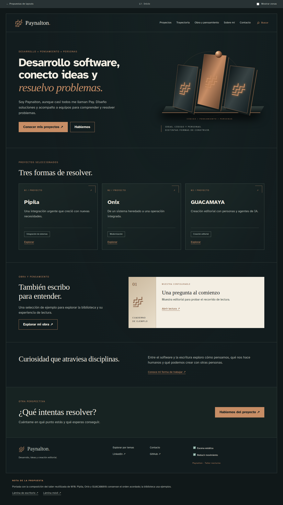

Escritorio · 1440 px · Recorte de la parte superior; abrir la imagen para ver la página completa.

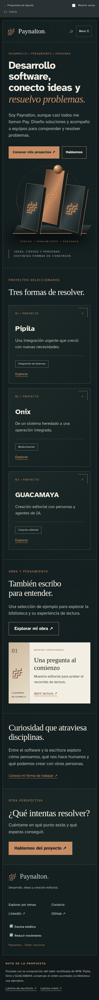

Móvil · 390 px · Recorte de la parte superior; abrir la imagen para ver la página completa.

Zonas: Presentación y escena del taller (W09 · W10 · W13); Proyectos destacados (W11); Selección configurable de obras (W11 · W23); Síntesis personal (Contenido editorial · W13); Invitación a conversar (W13).

[Abrir composición navegable](../propuesta_grafica_layouts/layouts/L1.html). Captura de estudio anterior a la paleta corregida; no acredita contraste final, fuentes definitivas ni efectos instalados.

## Atlas · L0 / Base compartida

L0 muestra el contenedor común sobre una página auxiliar, no una nueva sección del sitio. CV reservado fuera de la interfaz hasta disponer del documento.

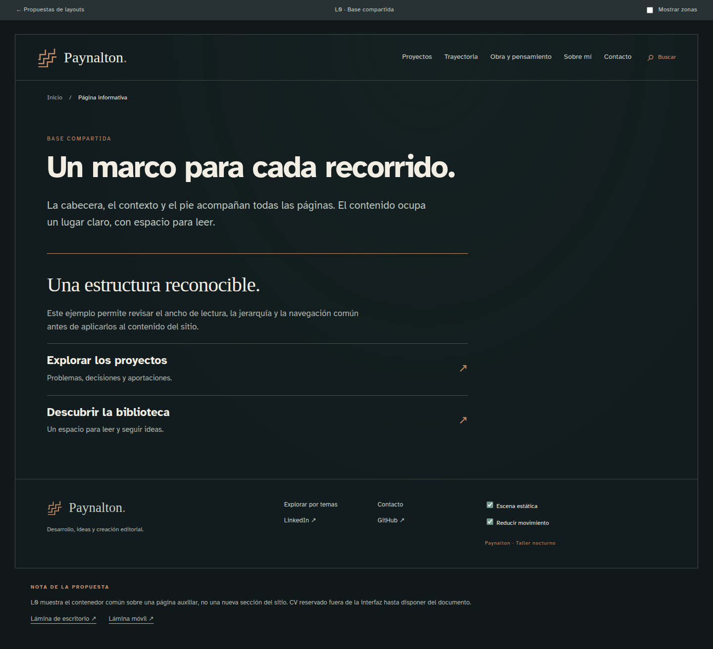

Escritorio · 1440 px · Recorte de la parte superior; abrir la imagen para ver la página completa.

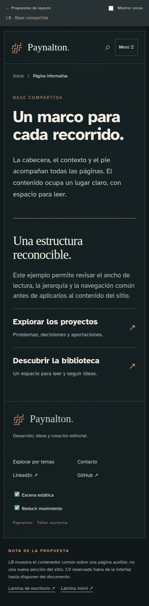

Móvil · 390 px · Recorte de la parte superior; abrir la imagen para ver la página completa.

Zonas: Contexto (W06); Contenido de una página auxiliar (Contenido editorial).

[Abrir composición navegable](../propuesta_grafica_layouts/layouts/L0.html). Captura de estudio anterior a la paleta corregida; no acredita contraste final, fuentes definitivas ni efectos instalados.

## Atlas · L2 / Catálogo de proyectos

Variante profesional de L2 con seis muestras; Pipila abre el detalle L3. Las otras tarjetas permiten evaluar densidad sin simular páginas de detalle terminadas.

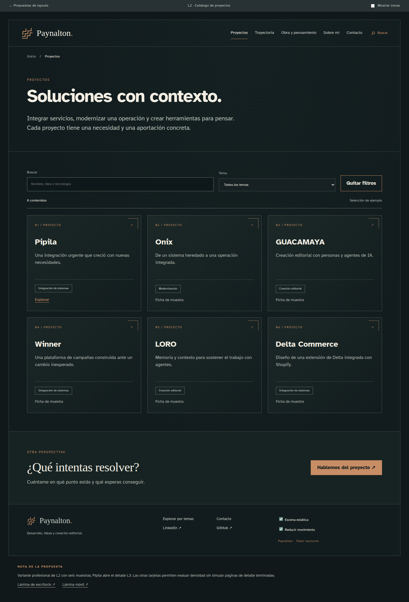

Escritorio · 1440 px · Recorte de la parte superior; abrir la imagen para ver la página completa.

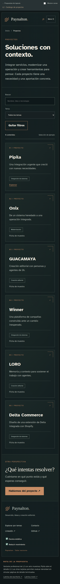

Móvil · 390 px · Recorte de la parte superior; abrir la imagen para ver la página completa.

Zonas: Contexto (W06); Encabezado de colección (Contenido editorial); Selección y listado (W05 · W11 · W14 · W15 · W30); Búsqueda y filtros (W05 · W14); Estado de resultados (W15); Invitación a conversar (W13).

[Abrir composición navegable](../propuesta_grafica_layouts/layouts/L2.html). Captura de estudio anterior a la paleta corregida; no acredita contraste final, fuentes definitivas ni efectos instalados.

## Atlas · L2-obra / Catálogo de obras

Variante editorial de L2. Solo usa ejemplos identificados; selección y contenido definitivo se incorporan al finalizar el proyecto.

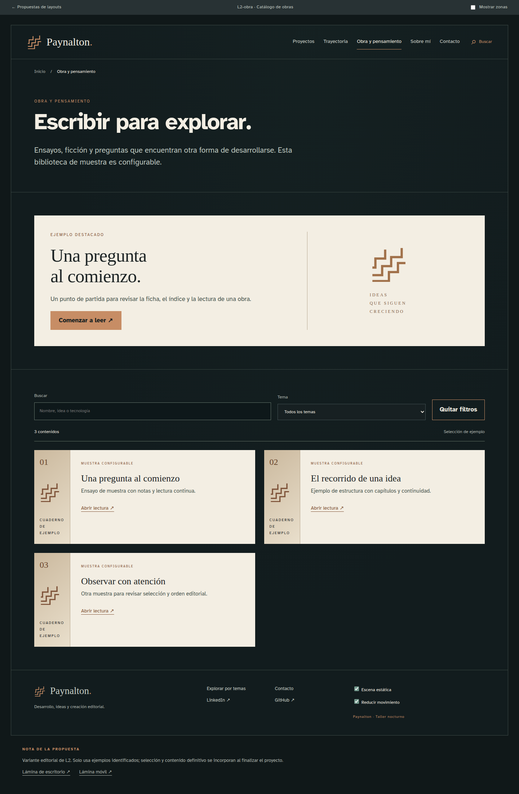

Escritorio · 1440 px · Recorte de la parte superior; abrir la imagen para ver la página completa.

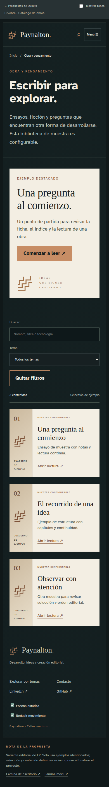

Móvil · 390 px · Recorte de la parte superior; abrir la imagen para ver la página completa.

Zonas: Contexto (W06); Encabezado editorial (Contenido editorial); Selección editorial (W11 · W23); Catálogo configurable (W05 · W11 · W14 · W15); Búsqueda y filtros (W05 · W14); Estado de resultados (W15).

[Abrir composición navegable](../propuesta_grafica_layouts/layouts/L2-obra.html). Captura de estudio anterior a la paleta corregida; no acredita contraste final, fuentes definitivas ni efectos instalados.

## Atlas · L2-explorar / Explorar y buscar

Variante de búsqueda global con resultados de distintos tipos, filtros locales y estado vacío comprobable.

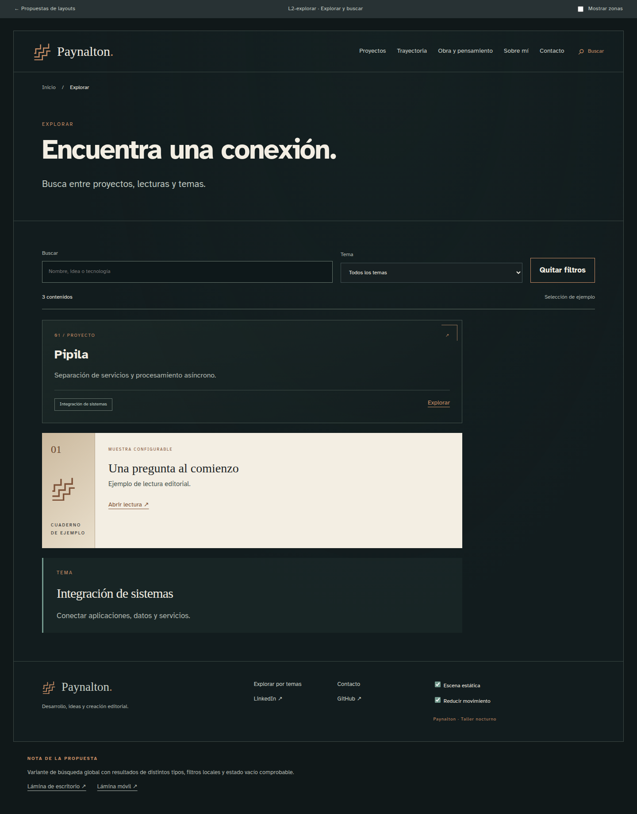

Escritorio · 1440 px · Recorte de la parte superior; abrir la imagen para ver la página completa.

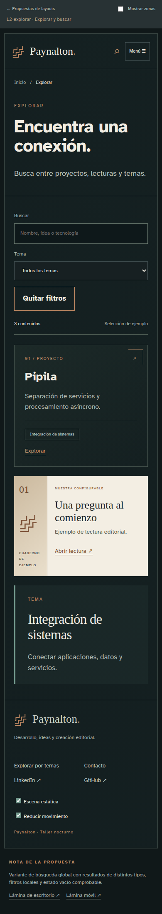

Móvil · 390 px · Recorte de la parte superior; abrir la imagen para ver la página completa.

Zonas: Contexto (W06); Consulta global (W05); Filtros y resultados (W05 · W14 · W15 · W11); Búsqueda y filtros (W05 · W14); Estado de resultados (W15).

[Abrir composición navegable](../propuesta_grafica_layouts/layouts/L2-explorar.html). Captura de estudio anterior a la paleta corregida; no acredita contraste final, fuentes definitivas ni efectos instalados.

## Atlas · L3 / Caso de proyecto

Caso completo con ficha y cuerpo editorial. Usa contenido disponible, sin detalles contractuales reservados; las evidencias condicionales no se rellenan con material ficticio.

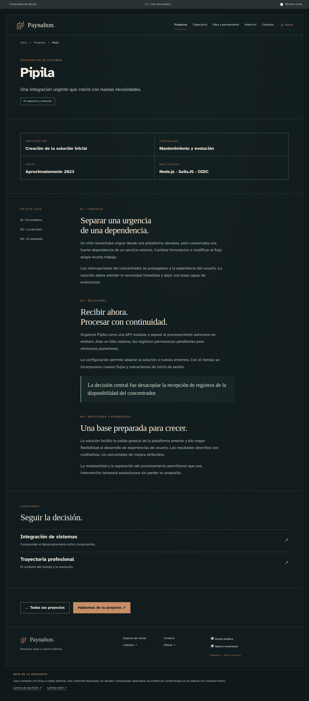

Escritorio · 1440 px · Recorte de la parte superior; abrir la imagen para ver la página completa.

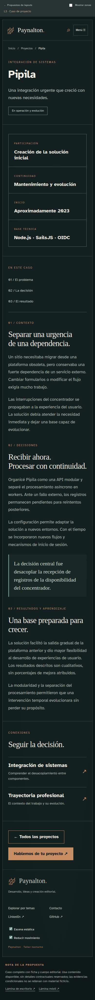

Móvil · 390 px · Recorte de la parte superior; abrir la imagen para ver la página completa.

Zonas: Contexto (W06); Encabezado del proyecto (Contenido editorial); Ficha de participación (W17); Contexto, decisiones y resultados (Contenido editorial); Capacidades y relaciones (W20 · W30 · W32); Compartir y continuar (W13 · W35).

[Abrir composición navegable](../propuesta_grafica_layouts/layouts/L3.html). Captura de estudio anterior a la paleta corregida; no acredita contraste final, fuentes definitivas ni efectos instalados.

## Atlas · L4 / Trayectoria profesional

Cronología completa de once etapas. W22 se reserva para cuando exista el CV: no hay botón falso ni documento de prueba descargable.

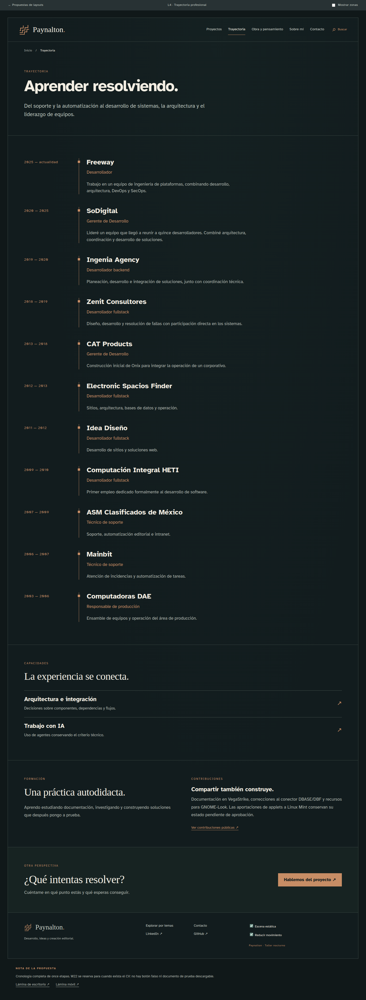

Escritorio · 1440 px · Recorte de la parte superior; abrir la imagen para ver la página completa.

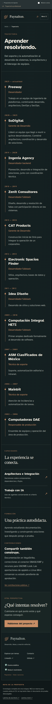

Móvil · 390 px · Recorte de la parte superior; abrir la imagen para ver la página completa.

Zonas: Contexto (W06); Resumen profesional (W09); Cronología y detalle (W21); Capacidades transversales (W20 · W32); Formación y comunidad (Contenido editorial · W08); Invitación a conversar (W13).

[Abrir composición navegable](../propuesta_grafica_layouts/layouts/L4.html). Captura de estudio anterior a la paleta corregida; no acredita contraste final, fuentes definitivas ni efectos instalados.

## Atlas · L5 / Publicación y lectura

Lector de ejemplo, no obra publicada. Los dos niveles de índice muestran la composición de pieza y capítulo; no hay descarga ficticia, preferencias avanzadas ni progreso simulado.

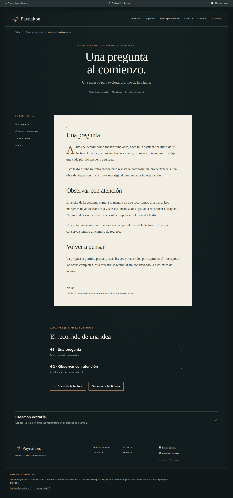

Escritorio · 1440 px · Recorte de la parte superior; abrir la imagen para ver la página completa.

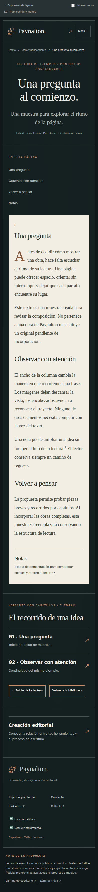

Móvil · 390 px · Recorte de la parte superior; abrir la imagen para ver la página completa.

Zonas: Contexto (W06); Ficha y presentación de obra (W23); Índice y lectura (W24 · W27); Índice y continuidad (W28); Temas y lecturas relacionadas (W30 · W32).

[Abrir composición navegable](../propuesta_grafica_layouts/layouts/L5.html). Captura de estudio anterior a la paleta corregida; no acredita contraste final, fuentes definitivas ni efectos instalados.

## Atlas · L6 / Tema y relaciones

Tema con definición, contexto, proyectos y etapa profesional. Las relaciones tienen explicación; no se agrega el grafo posterior para llenar espacio.

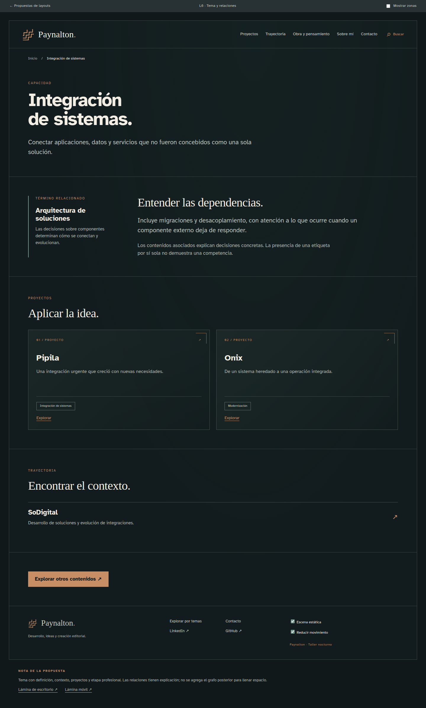

Escritorio · 1440 px · Recorte de la parte superior; abrir la imagen para ver la página completa.

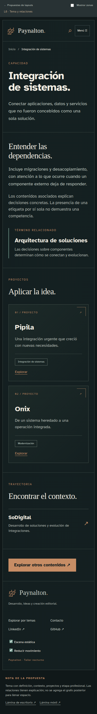

Móvil · 390 px · Recorte de la parte superior; abrir la imagen para ver la página completa.

Zonas: Contexto (W06); Identidad del término (W31); Contexto y relaciones (W31 · W32); Proyectos asociados (W11 · W20 · W30); Experiencia vinculada (W20 · W32); Continuación (W13).

[Abrir composición navegable](../propuesta_grafica_layouts/layouts/L6.html). Captura de estudio anterior a la paleta corregida; no acredita contraste final, fuentes definitivas ni efectos instalados.

## Atlas · L7 / Sobre mí

Perfil sin repetir toda la cronología. Integra método y lecturas como voz personal; las obras aplazadas no aparecen.

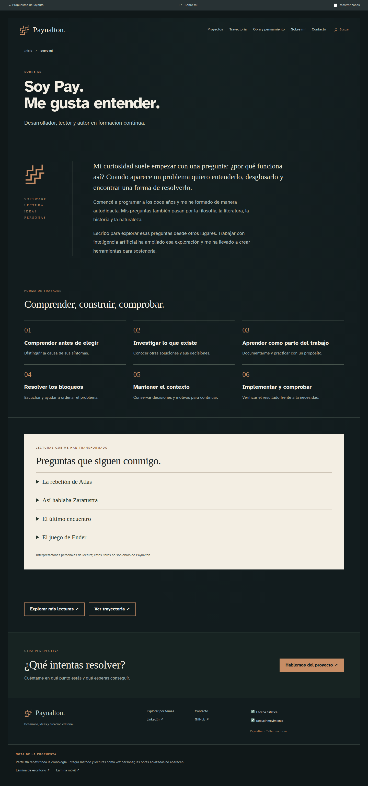

Escritorio · 1440 px · Recorte de la parte superior; abrir la imagen para ver la página completa.

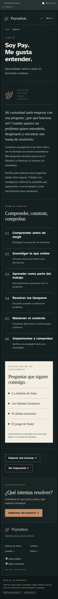

Móvil · 390 px · Recorte de la parte superior; abrir la imagen para ver la página completa.

Zonas: Contexto (W06); Identidad (Contenido editorial); Biografía e intereses (Contenido editorial); Forma de trabajar (Contenido editorial · W20); Lecturas y pensamiento (Contenido editorial · W32); Perfiles y continuación (W08 · W13); Invitación a conversar (W13).

[Abrir composición navegable](../propuesta_grafica_layouts/layouts/L7.html). Captura de estudio anterior a la paleta corregida; no acredita contraste final, fuentes definitivas ni efectos instalados.

## Atlas · L8 / Contacto

Contacto directo, sin formulario ni simulación de envío. CV y canales sin destino confirmado se omiten hasta que estén disponibles.

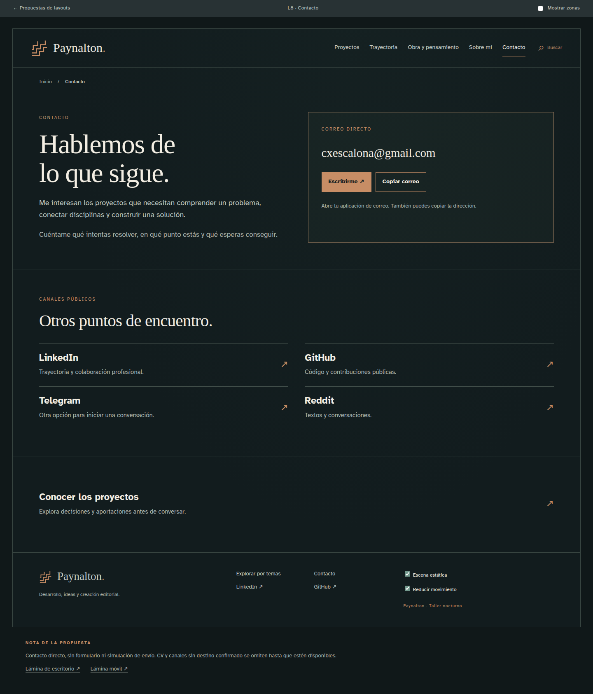

Escritorio · 1440 px · Recorte de la parte superior; abrir la imagen para ver la página completa.

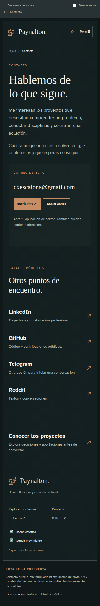

Móvil · 390 px · Recorte de la parte superior; abrir la imagen para ver la página completa.

Zonas: Contexto (W06); Invitación y canal principal (W13 · W34); Contacto profesional y otros espacios (W08); Recursos profesionales (W13).

[Abrir composición navegable](../propuesta_grafica_layouts/layouts/L8.html). Captura de estudio anterior a la paleta corregida; no acredita contraste final, fuentes definitivas ni efectos instalados.

## 10 · Anexos y orden de referencia

Ante diferencias entre la imagen original y una decisión posterior, prevalece la decisión posterior del propietario. Para color y contraste, usar la paleta corregida y su informe; para alcance, conservar los estados de los widgets y las decisiones editoriales actualizadas. Las capturas explican composición y no sustituyen las especificaciones.

| Documento | Uso |
| --- | --- |
| [Contenido editorial](../Contenidos_editoriales_Paynalton_ES.md) | Fuente de textos, junto con las decisiones posteriores del propietario. |
| [Pendientes priorizados](../Pendientes_editoriales_priorizados_Paynalton.md) | Alcance editorial vigente y trabajo diferido. |
| [Navegación](../Mapa_navegacion_Paynalton.md) | Recorridos del visitante. |
| [Rutas y contenidos](../Propuesta_mapa_rutas_y_contenidos_Paynalton.md) | Organización de destinos y preservación de enlaces. |
| [Widgets y ubicaciones](../Widgets_y_mapa_de_ubicacion_Paynalton.md) | Relación funcional entre componentes y páginas. |
| [Galería de layouts](../propuesta_grafica_layouts/index.html) | Composiciones navegables completas. |
| [Galería de widgets](../propuesta_grafica_widgets/index.html) | 40 estudios individuales con su alcance. |
| [Paleta RGBA](../propuesta_grafica_layouts/Propuesta_esquema_colores_RGBA.md) | 42 nombres por uso y reglas de combinación. |
| [Validación WCAG](../propuesta_grafica_layouts/Validacion_WCAG_paleta.md) | Resultados, restricciones y fuentes normativas. |
| [Recursos gráficos](../propuesta_grafica_layouts/Inventario_de_imagenes_y_recursos_graficos.md) | Especificaciones y relación con efectos. |
| [Efectos visuales](../propuesta_grafica_layouts/Propuesta_de_efectos_visuales.md) | Movimiento, librerías propuestas y modos de calidad. |
| [Plan de trabajo](../Plan_de_trabajo_recomendado_Paynalton.md) | Ejecución y validación del proyecto. |

El HTML es la edición de revisión con enlaces a las muestras completas; requiere conservar las carpetas hermanas. El PDF es la edición portátil de presentación, con las láminas incorporadas; los prototipos enlazados requieren el paquete local. El Markdown conserva el contenido editable del dossier.
