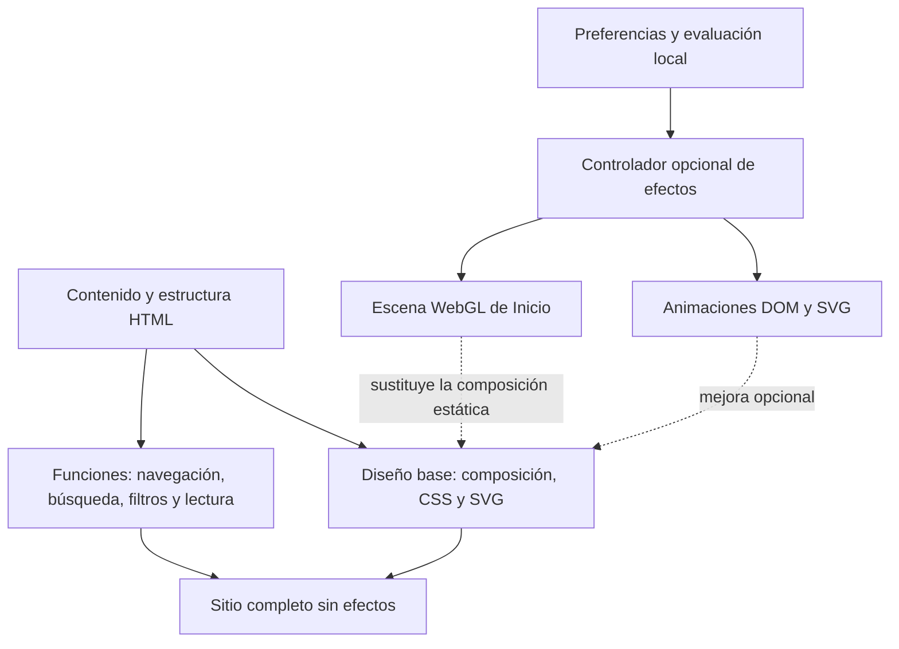

# Propuesta de efectos visuales — Taller nocturno

**Implementación PT10:** [entrega y validación](../implementacion/PT10/README.md). FX01–FX10/FX13 integrados con Three.js 0.186.1 y APIs nativas, sin necesidad de Motion. Para conservar contraste, los textos no reducen opacidad: se animan desplazamientos o acentos decorativos. El cierre de paneles devuelve el foco inmediatamente. El resto de este documento conserva las especificaciones de la propuesta; consultar PT10 para decisiones finales y métricas.

Propuesta del 29 de septiembre de 2026. Complementa los layouts y widgets ya diseñados. Define efectos para implementar y comprobar; no describe funciones instaladas.

## 1. Dirección

Un momento de impacto en Inicio y una interacción cuidada en el resto del sitio. El movimiento debe sugerir material, profundidad y continuidad: cobre que recibe luz, planos que responden suavemente y conexiones que se hacen visibles.

La composición, tipografía, colores, grecas y contenido pertenecen a la capa visual permanente. Los efectos son una mejora independiente. Desactivarlos debe conservar un sitio completo, atractivo y funcional, sin espacios vacíos ni cambios de distribución.

**Regla de intensidad:** un solo foco de movimiento dominante por pantalla. Sin animación ornamental continua durante la lectura. Los valores siguientes son puntos de partida de diseño, ajustables después de probarlos en dispositivos reales.

## 2. Lista de efectos propuestos

| ID | Efecto y experiencia | Ubicación | Técnica propuesta | Intensidad y límite | Al desactivarlo |
| --- | --- | --- | --- | --- | --- |
| FX01 | **Ensamble del taller:** los planos de obsidiana y cobre terminan de acomodarse en una composición ya reconocible | Inicio, L1 / W10 | Three.js; geometría local y animación de transformaciones | Una entrada de 700–1000 ms, desplazamiento corto, sin explosión de piezas; nunca bloquea el titular | Composición estática con idéntico espacio reservado |
| FX02 | **Profundidad al puntero:** la escena responde con un giro pequeño y vuelve a reposo | Inicio, L1 / W10 | Three.js, interpolación de cámara u objeto | Giro máximo inicial de ±3°; solo sobre la escena y con puntero preciso; sin seguimiento global del cursor | La escena permanece inmóvil |
| FX03 | **Reflejo de cobre:** el cambio de ángulo revela un brillo cálido en bordes y superficies | Inicio, L1 / W10 | Materiales e iluminación de Three.js, evitando posprocesado inicial | Acompaña FX01/FX02; no pulsa en bucle ni barre toda la pantalla | Iluminación integrada en la alternativa estática |
| FX04 | **Entrada editorial:** títulos secundarios y grupos seleccionados se asientan suavemente al entrar en pantalla | Inicio y secciones de L2, L4 y L7 / W09, W11, W21 | Motion para JavaScript o CSS con observación de visibilidad | 240–360 ms; desplazamiento de 8–12 px; separación máxima de 50 ms entre tres elementos; una vez por visita a la página | Contenido inmediatamente visible en su posición final |
| FX05 | **Greca trazada:** una línea de cobre recorre brevemente un remate o separador | Inicio y encabezados seleccionados / ornamentos | SVG y CSS; Motion solo si se coordina una secuencia | 400–600 ms, una vez; como máximo dos zonas por página | Greca completa desde el principio |
| FX06 | **Tarjeta que responde:** elevación mínima, borde cobre y acento en la flecha al interactuar | Catálogos y destacados / W11, W13 | CSS sobre transformaciones y opacidad | 140–200 ms; elevación máxima de 3 px; sin inclinar bloques de texto | Borde y foco cambian inmediatamente, sin desplazamiento |
| FX07 | **Selección continua:** subrayado que acompaña a la opción activa | Navegación, filtros y pestañas pertinentes / W03, W14 | CSS; Motion únicamente si hace falta coordinar posiciones | 120–180 ms; el estado activo siempre se identifica también sin movimiento | Subrayado y selección instantáneos |
| FX08 | **Paneles suaves:** apertura y cierre del menú móvil, buscador y filtros | L0 y L2 / W03, W05, W14 | CSS o Motion, con lógica funcional independiente | 160–220 ms; desplazamiento máximo de 8 px; evitar zoom de pantalla completa | Abrir/cerrar inmediato; teclado y foco conservan su comportamiento |
| FX09 | **Cambio de resultados:** transición breve después de aplicar un filtro | L2 / W11, W14, W15 | Web Animations API o Motion; transformación entre posiciones si resulta necesaria | 160–220 ms; priorizar respuesta inmediata; cancelar la transición anterior si cambia la consulta | Lista y contador se actualizan inmediatamente |
| FX10 | **Hilo de trayectoria:** el acento de la línea identifica la etapa que entra en la zona de lectura | L4 / W21 | SVG/CSS e IntersectionObserver | Cambios breves de 120–180 ms; sin números animados, desplazamientos laterales ni línea dibujándose continuamente | Cronología y todos sus enlaces visibles; acento fijo o cambio instantáneo |
| FX11 | **Continuidad entre catálogo y detalle:** fundido corto al abrir un proyecto o una obra | L2 → L3/L5 | View Transition API cuando exista soporte | 150–220 ms; solo áreas acotadas; no retener la navegación para esperar una animación | Navegación convencional del navegador |
| FX12 | **Relación destacada:** una conexión y sus extremos reciben un acento al enfocarlos | L6 / W32; grafo W33 cuando se incorpore | SVG y CSS; sin necesidad de WebGL | 120–180 ms, solo ante interacción; nada de nodos flotando permanentemente | Relación resaltada de inmediato y explicación textual disponible |
| FX13 | **Confirmación discreta:** cambio de icono o énfasis al copiar un enlace o correo | W34, W35 | CSS; estado accesible gestionado por la función de copia | 120–160 ms; sin partículas ni destellos | Mensaje textual de confirmación, igualmente accesible |
| FX14 | **Apertura de evidencia:** el recurso pasa a un visor mediante un fundido corto | W18/W19, cuando se implementen | CSS o Web Animations API; reutilizar el visor | 160–220 ms; sin expansión que recorra toda la pantalla | El visor abre inmediatamente y conserva cierre, foco y descripción |

### Selección inicial

Implementar FX01–FX10 y FX13 como familia inicial. FX01–FX03 comparten una sola escena, un renderer y sus recursos: no son tres motores ni tres descargas.

FX11 se incorpora después de comprobar que no altera historial, anclas, foco ni navegación. FX12 se limita inicialmente a relaciones enlazadas; el grafo sigue siendo una ampliación posterior. FX14 acompaña la implementación futura de los visores y no obliga a introducirlos ahora.

No aplicar FX04 a cada párrafo ni ocultar el titular de Inicio esperando a que cargue una librería. Las animaciones acompañan contenido que ya puede leerse.

## 3. Qué se verá en cada layout

| Layout | Efectos y criterio |
| --- | --- |
| L0 — Base | Respuesta de navegación, paneles y confirmaciones. Preferencias de efectos disponibles en el pie y accesibles desde la cabecera móvil. |
| L1 — Inicio | FX01–FX03 como protagonista. Aparición discreta de grupos, algún remate de greca y respuesta de tarjetas. |
| L2 — Catálogos y búsqueda | Respuesta de tarjetas, filtros y transición de resultados. Sin una segunda escena 3D detrás del catálogo. |
| L3 — Proyecto | Navegación y relaciones cuidadas; el cuerpo del caso permanece quieto. Visores animados solo si se incorporan. |
| L4 — Trayectoria | Una entrada discreta del conjunto y acentos de etapas; los detalles se abren sin desplazar inesperadamente la lectura. |
| L5 — Lectura | Cuerpo, notas e índice sin efectos ornamentales de entrada. Controles con respuesta breve y navegación ordinaria por capítulos. |
| L6 — Tema | Respuesta de enlaces y conexiones explícitas; nada de fondo animado detrás de la definición. |
| L7 — Sobre mí | Entrada suave de secciones y respuesta de detalles desplegables. Sin animación de letras ni retrato que siga el cursor. |
| L8 — Contacto | Énfasis de botones y confirmación de copia. Sin efectos que demoren el acceso al correo. |

## 4. Librerías y alcance de uso

| Herramienta | Elección | Uso y límite |
| --- | --- | --- |
| **Three.js** | Motor 3D propuesto | Solo la escena de Inicio. Geometría, materiales y recursos servidos por el propio sitio. No se carga en las demás páginas. |
| **Motion, API JavaScript** | Una sola librería de animación general | Secuencias cortas y coordinación cuando CSS no baste; no añadir React o Vue para usarla. Limitarse a las funciones abiertas del paquete, sin Motion+ ni herramientas de pago. |
| **CSS, SVG y Web Animations API** | Primera opción para efectos sencillos | Foco, botones, grecas, enlaces, pequeños fundidos y estados. Evitar una dependencia por cada efecto. |
| **View Transition API** | Mejora condicional | Transiciones entre páginas cuando sean compatibles con la navegación elegida. No obliga a convertir el sitio en una aplicación de navegación interceptada. |
| **Lenis** | No incluir en la propuesta inicial | No necesitamos suavizar globalmente el desplazamiento para conseguir este diseño. Mantener el comportamiento nativo de rueda, teclado, táctil y anclas. |

Three.js y el paquete abierto Motion usan licencia MIT. Se conservarán sus avisos y se fijarán las versiones durante la implementación; esta propuesta no instala paquetes ni presupone disponibilidad de extensiones premium. [Licencia de Three.js](https://github.com/mrdoob/three.js/blob/dev/LICENSE), [licencia de Motion](https://github.com/motiondivision/motion/blob/main/LICENSE.md).

Motion permite animar HTML, SVG y valores de objetos desde JavaScript. Esa API es suficiente para las secuencias propuestas; no se requiere la edición comercial de la herramienta. [Inicio de Motion para JavaScript](https://motion.dev/docs/quick-start), [API animate](https://motion.dev/docs/animate).

View Transition API ofrece transiciones visuales que deben tratarse como mejora progresiva. Se detectará soporte para la modalidad concreta antes de activarla. [Documentación de View Transition API](https://developer.mozilla.org/en-US/docs/Web/API/View_Transition_API).

Aunque Lenis dispone de mecanismos de movimiento reducido, su integración seguiría siendo una decisión adicional sobre el desplazamiento. Aquí se descarta por falta de necesidad visual, no por afirmar que sea incompatible con el sitio. [Documentación oficial de Lenis](https://github.com/darkroomengineering/lenis).

## 5. Separación de capas

### Capa visual permanente

Define tamaños, columnas, contraste, tipografía, fondo, grecas y estados de foco. Tiene todas las posiciones finales resueltas. La escena reserva su espacio y muestra su alternativa estática desde el HTML inicial.

No depende de clases que solo añada el motor de animación para hacer visible el contenido. Los elementos decorativos no interceptan enlaces ni eventos de los controles.

### Capa funcional

Abre menús, aplica filtros, mueve el foco, copia texto, actualiza resultados y mantiene estados accesibles. Puede notificar un cambio a la capa de efectos, pero nunca espera su finalización para completar una operación.

Una animación cancelada no debe impedir cerrar un panel, dejar contenido bloqueado ni mantener un control con estado incorrecto. Desactivar efectos no desactiva JavaScript funcional.

### Capa opcional de efectos

Se carga mediante módulos independientes, únicamente donde se utilicen. Recibe elementos y eventos de la página sin apropiarse del contenido. Cada efecto declara nivel mínimo, zona de uso y operaciones equivalentes a **iniciar, pausar, actualizar calidad y destruir**.

La separación se verifica técnicamente: el diseño base y los módulos funcionales no importan Three.js ni Motion. La decisión de habilitar efectos ocurre antes de solicitar esos paquetes. La configuración permite retirar toda la capa en una compilación conservando el mismo sitio funcional.

Al destruir la capa se cancelan animaciones, temporizadores y fotogramas pendientes; se desconectan observadores y eventos propios; se restablecen únicamente los estilos que añadió el efecto. La escena libera geometrías, materiales, texturas y renderer. Ocultar el canvas no basta. [Liberación de recursos de Three.js](https://threejs.org/manual/pages/how-to-dispose-of-objects.html).

## 6. Modos de funcionamiento

| Modo visible | Comportamiento |
| --- | --- |
| **Automático** — predeterminado | Empieza con el sitio estático; habilita respuesta ligera y evalúa si puede cargar la escena. Reduce calidad o desactiva efectos si detecta dificultades sostenidas. |
| **Suave** | Microinteracciones breves y fundidos acotados; sin WebGL, paralaje ni movimiento de tarjetas. |
| **Completo** | Escena y efectos permitidos en la página, respetando los límites de movimiento y rendimiento. No significa efectos permanentes ni forzar una GPU que falla. |
| **Sin efectos** | Sin animación decorativa ni motor 3D. Mantiene composición, contenido, navegación, búsqueda, filtros, foco y confirmaciones instantáneas. |

Añadir **Desactivar 3D** como elección independiente para conservar microinteracciones sin escena. La preferencia se guarda localmente cuando sea posible; si el almacenamiento está bloqueado, funciona durante la sesión sin errores.

### Orden de decisión

1. Sin JavaScript o con efectos deshabilitados en la entrega: diseño base completo.
2. Elección explícita **Sin efectos**: no cargar librerías, modelos ni texturas; limpiar los recursos ya activos.
3. Preferencia del sistema de movimiento reducido: omitir entrada espacial, paralaje, desplazamientos y transición entre páginas. No reproducir movimiento ornamental automáticamente aunque se haya guardado Completo. Los controles siguen respondiendo de forma inmediata.
4. Elección **Suave** o **Desactivar 3D**: no importar Three.js ni descargar recursos de la escena.
5. En Automático, señales de ahorro de datos, ausencia de WebGL o errores gráficos aconsejan conservar la alternativa estática. Las señales de hardware disponibles solo orientan; ninguna clasifica con certeza el rendimiento del equipo.
6. Si es candidato a la escena, realizar una inicialización pequeña tras el contenido esencial y observar el rendimiento. No ejecutar un benchmark pesado previo ni solicitar un perfil del dispositivo a servicios externos.
7. Si el rendimiento sostenido es insuficiente, bajar calidad y después volver a la alternativa estática. Evitar oscilaciones: no reactivar automáticamente durante la misma visita una escena que se deshabilitó por problemas.

El tamaño de pantalla no determina la potencia. La disponibilidad de puntero preciso solo decide si tiene sentido FX02; no se usa como medición de GPU. Las APIs de ahorro de datos o hardware pueden faltar: su ausencia no equivale a capacidad ilimitada.

La desconexión detiene trabajo futuro; no puede deshacer descargas ya completadas. La preferencia guardada sí evita solicitarlas en visitas posteriores.

## 7. Presupuestos iniciales y adaptación

Son objetivos de diseño y prueba, no resultados medidos todavía.

| Aspecto | Objetivo inicial |
| --- | --- |
| Escena | Un canvas y un renderer; máximo aproximado de 60 000 triángulos y 30 llamadas de dibujo para comenzar el prototipo |
| Recursos 3D | Intentar mantener geometría, texturas y entorno de reflejos, si existe, en un total de 1 MB transferido; medir por separado motor, decodificadores y alternativa estática. Si la geometría se genera por código, contabilizar ese módulo como coste de la escena |
| Resolución | Relación de píxeles limitada inicialmente a 1,5; bajar a 1 si es necesario, sin copiar siempre la densidad física del dispositivo |
| Animación DOM | Preferir transformaciones y opacidad; objetivo de hasta 35 KB comprimidos de código opcional propio y de coordinación, aparte del motor 3D |
| Reposo | Sin bucle ornamental activo: renderizar la escena cuando cambia algo y detenerse al asentarse |
| Visibilidad | Pausar cuando la escena salga de pantalla o la pestaña quede oculta; reanudar solo si el modo sigue permitiéndolo |
| Muestreo | Observar intervalos de fotogramas durante actividad visible; no contar pestañas ocultas, reposo ni arranque como rendimiento sostenido |
| Degradación | Como punto de partida, dos ventanas activas de 2 segundos con intervalos medianos mayores a 40 ms justifican reducir calidad; si persiste, usar la alternativa estática |

La animación se calcula con tiempo transcurrido, no con un avance fijo por fotograma. El muestreo es una aproximación: pausas de JavaScript o tareas ajenas también afectan los intervalos. No se presenta como diagnóstico exacto de la GPU.

En la escena inicial se priorizan materiales, buena iluminación y composición sobre bloom, profundidad de campo, reflejos en tiempo real o sombras costosas. La calidad puede bajar sin cambiar el significado ni la posición del contenido.

Three.js documenta renderizado bajo demanda y control explícito del tamaño del buffer; son las bases propuestas para evitar trabajo continuo y resoluciones innecesarias. [Renderizado bajo demanda](https://threejs.org/manual/pages/rendering-on-demand.html), [diseño adaptable](https://threejs.org/manual/pages/responsive.html).

## 8. Efectos que no incluiremos

- Fondo de partículas permanente, lluvia de símbolos o ruido animado detrás del texto.
- Cursor personalizado que sustituya al del sistema o botones que huyan hacia el puntero.
- Desplazamiento secuestrado, scroll horizontal forzado o secciones fijadas durante largos recorridos.
- Rotaciones fuertes, zoom de página completa o paralaje aplicado al cuerpo de lectura.
- Escritura letra por letra, texto desordenándose, números que cuentan hasta métricas o titulares que demoran en aparecer.
- Audio automático, destellos o animaciones que se repitan para reclamar atención.
- Un canvas o motor 3D por tarjeta, ni carga de todas las librerías en todas las páginas.
- Dependencias comerciales, servicios externos obligatorios o un segundo motor de animación para efectos que ya cubre la elección inicial.

## 9. Comprobaciones de aceptación

1. Comparar cada layout en modo Completo y Sin efectos: mismos textos, orden, dimensiones reservadas y accesos. La captura estática puede cambiar en la zona de la escena, pero no la estructura.
2. Iniciar con Sin efectos guardado y revisar la red: cero solicitudes de Motion, Three.js, modelos y texturas de efectos. Distinguir los SVG y la composición estática del diseño base, que sí permanecen.
3. Desactivar durante una animación: interfaz en estado final correcto, escena sustituida, sin eventos decorativos ni bucles de dibujo activos.
4. Simular fallo de importación, WebGL no disponible y pérdida de contexto: contenido visible, sin bloqueo ni reintentos continuos.
5. Probar movimiento reducido al iniciar y al cambiar la preferencia durante la sesión.
6. Probar almacenamiento bloqueado: cambiar el modo sigue funcionando durante la visita.
7. Comprobar pausa y retorno al cambiar de pestaña, salir del área visible y navegar entre páginas, incluido volver/avanzar.
8. Repetir apertura y cierre de páginas y paneles para detectar listeners duplicados, canvas acumulados y recursos sin liberar.
9. Verificar teclado, foco, anclas, selección de texto y lectura sin depender de animaciones.
10. Medir carga, respuesta y estabilidad visual con y sin efectos; probar además un equipo de baja potencia real. La emulación de CPU no sustituye la comprobación de GPU.

## 10. Orden de implementación

1. Mantener los layouts estáticos como referencia de composición.
2. Implementar el control de modos, carga opcional y limpieza, antes de añadir efectos individuales.
3. Incorporar FX06–FX09 y FX13; verificar que la capa funcional no dependa de sus transiciones.
4. Prototipar FX01–FX03 con la alternativa estática, pausa y degradación de calidad.
5. Añadir FX04, FX05 y FX10 con moderación; eliminar cualquier movimiento que compita con la lectura.
6. Evaluar FX11 y los efectos de componentes posteriores cuando se implementen esas funciones.

La biblioteca se prueba con ejemplos configurables. La incorporación posterior de obras completas y la generación del CV no condicionan esta capa. La propuesta añade movimiento a la identidad aprobada sin exigir rediseñar el sitio para desactivarlo.

## 11. Recursos gráficos asociados

El inventario de imágenes queda ampliado con 3D-01 (escena modular), MAT-01 (materiales), TEX-01 (mapas condicionales) y ENV-01 (entorno condicional). IMG-01/IMG-02 deben corresponder al estado final de la escena; VEC-02 conserva trazados animables y VEC-03 añade confirmación de copia. Los demás efectos reutilizan recursos existentes. Esta correspondencia no exige texturas ni entorno basado en imagen cuando los materiales y la iluminación simples sean suficientes.
